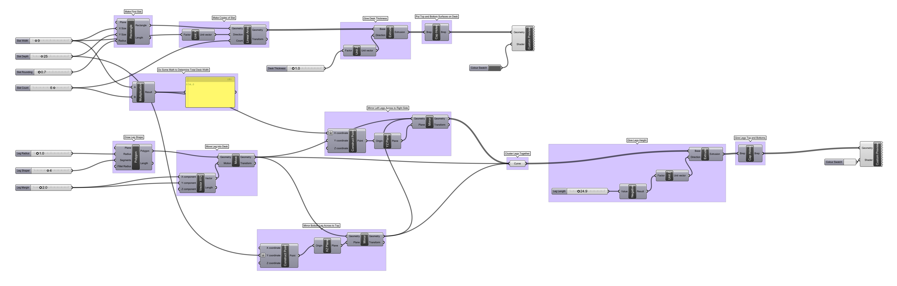

- [Floyd](https://floydhome.com/products)
- [De-Sk](https://de-sk.co/buy)
- [Radiolaria by Nervous System](https://n-e-r-v-o-u-s.com/projects/albums/radiolaria-2/)

-----

### Grasshopper Definition · Parametric Table

Let's take a look at how a table like [De-Sk](https://de-sk.co/buy) could be parameterized and recreated in Grasshopper.

[Download](desk-definition.gh)

This visual code is much more powerful than our cup example, and can produce a variety of 3D models such as these:

What other parameters could we imagine implementing in work surface design? 

-----