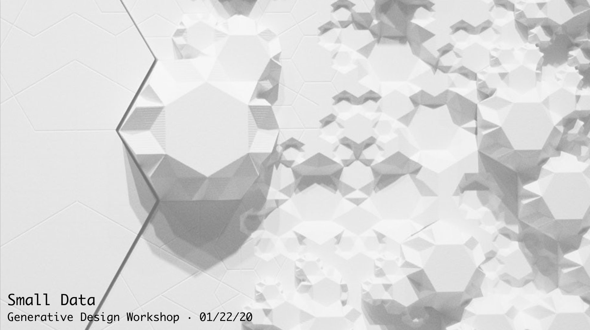
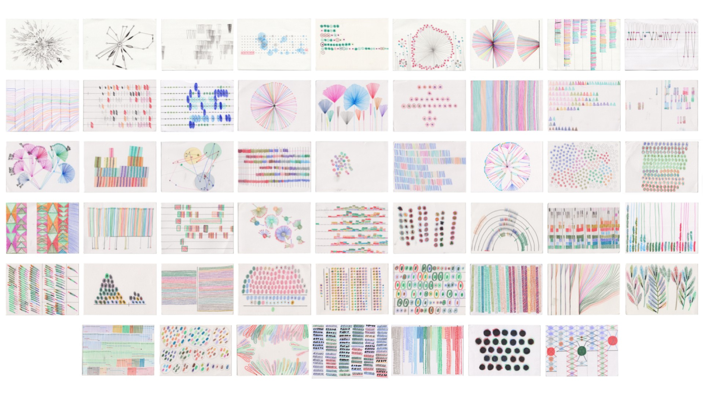

# Week 01 · Course Overview

### Slides

[Generative Design and *Small Data* Intro Presentation](small-data.pdf)

-----

### Course Resource Repository

Access relevant readings, datasets, and tutorials for the course [here](https://drive.google.com/drive/folders/1MFnHnPpG6v-mKBOOcnNrqlkPvNoJlrY-?usp=sharing). 

-----

### Exercise

Based on the work of [Giorgia Lupi](http://giorgialupi.com) & [Stefanie Posavec](http://www.stefanieposavec.com) in [Dear Data](http://www.dear-data.com/theproject), which was [acquired by MOMA in 2016](https://medium.com/@giorgialupi/dear-data-has-been-acquired-by-moma-but-this-isnt-what-we-are-most-excited-about-bdaa3376d9db), let's do some manual data aggregation and create some hand-drawn data visualizations with primary school art supplies!

Let's consider the *Dear Data* week 12 "a week of people" and week 25 "a week of friends" prompts.

Start by mining your mobile computing device for data, and construct a multi-dimensional dataset for visualization. Consider all the different ways we could encode messaging data: content, frequency, category of contact, directionality, source and target, sentiment, emojis and attached/embedded media....

Based on this data, create a set of five visualizations on one side of a postcard-sized piece of paper, with keys communicating how to read your encoding system on the other side. 

-----

### Homework

##### Reading

- Chapter 1 (PDF pages 11-45) from Edward Tufte's [*Beautiful Evidence*](https://drive.google.com/drive/folders/1MFnHnPpG6v-mKBOOcnNrqlkPvNoJlrY-?usp=sharing)

##### Listening 

- [*Data Stories* Podcast](https://datastori.es/149-xkcd-or-the-art-of-data-storytelling-with-web-cartoons/) interview with Randall Munroe of [xkcd](https://www.xkcd.com) web comic fame.

- [*Data Stories* Podcast](https://datastori.es/125-researching-the-boundaries-of-infovis-with-sheelagh-carpendale/) interview with Sheelagh Carpendale.

##### Research

- Compose a one to three page PDF on a generative design or data visualization project **not** mentioned in the course kick-off slide deck (though feel free to investigate other projects by the referenced designers/visualizers/architects). Attempt to provide the kind of content one might find on a [museum tombstone](https://en.wikipedia.org/wiki/Museum_label), as well as a key or overlay describing how to read the data embedded in the object/visualization.

##### Visualization Practice (This will be ongoing!)

- Take a peak at the Dear Data first week on *Clock* and time visualizations in preparation for next week. Through the week, construct a dataset for your own visualization purposes on how you are spending your time through the week, and produce 5 visualizations on 4"x6" carts. Explore both 2D and 3D visualization opportunities.

##### Software Installation

- Immediately before class next week (Tuesday, January 28), download and install the evaluation version of [Rhinoceros 6](https://www.rhino3d.com/download). You may decide to purchase it for the [student cost of $195](https://www.rhino3d.com/sales/north-america/United_States).