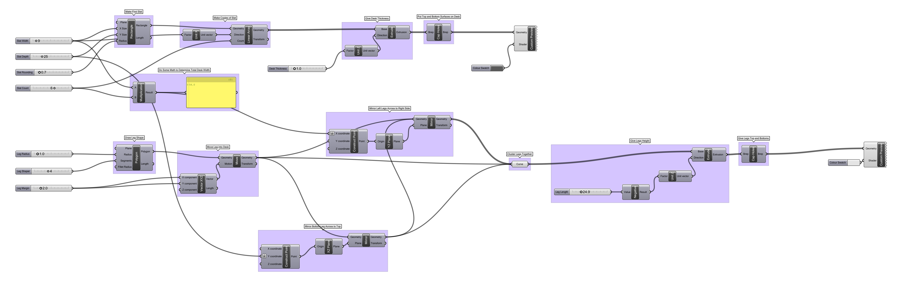

# Week 2 · Parametric Definitions

This week, let's discuss how we as designers can meaningfully *parameterize* a specific design opportunity into a set of dimensionable, flexible, understandable, and ultimately manufacturable or implementable aspects. This approach superficially has much in common with traditional design and engineering methods, though can differ meaningfully in its intentionality and possiblility for expression.

-----

### References for the Week

- [Tylko Bookshelves](https://tylko.com)
- [Article on Tylko with Founder Interview](https://www.curbed.com/2015/6/24/9946872/tylko-furniture-app-augmented-reality)
- [Floyd](https://floydhome.com/products)
- [De-Sk](https://de-sk.co/buy)
- [Radiolaria by Nervous System](https://n-e-r-v-o-u-s.com/projects/albums/radiolaria-2/)

-----

### Parametric Definitions

A critical early phase in any generative design approach is the creation of a **parametric definition** or **rig**, which is the identification and interrelation of the *designable* aspects of a product, service, or experience. It is important that these aspects all be given names, and have a known degree of flexibility — are they variables or constants? These are the *parameters* of the design, and when connected together, generative designers often term the resulting formula of parameters the *definition* of the design.

When parameters are fully determined, we then have a skeleton, or chromosome to stretch the biological analogy, of everything that the design could be. Playing with the parameters will allow a designer to see the full expression of their design — the constellation of all products that might result from their design intent.

This is a powerful mechanism to bring to all design processes — imagine all of the outcomes that might come out of your design intent — the *domain of the design*, before making any specific design choices.

-----

### Parametric Definition Example : Cups

###### Todd was right! Heath on the left, Hasami on the right ######

It is easiest to consider physical products when implementing parametric definitions. For example, the simple parameters of a ceramic cup might be (leaving aside the complexity of the handle) total height, radius/diameter at top, radius/diameter at bottom, foot height, and wall thickness. It is often the case that the simple parameters of a product align with what would be defined in a [common engineering drawing](http://www.loc.gov/pictures/search/?st=grid&co=ade).

More complex parameters might allow for material selection, overall (non-conic) form, handle shape and size, lip geometry, styling and surface finish, ethical decisions about the  environmental impact of its manufacture and social condition of its fabricators, intended product lifespan... And, at some point, this parameter expansion would yield a definition capable of generating bowls, plates, vases, and carafes as well as the original mug.

How might we begin to parameterize something like a subscription service in this same way?

-----

### Types of Parameters

- Flexible : The parameter is entirely free (a couch could be *any* length)
- Categorical : The parameter is allowed to be any member of a set of fixed values (a table could be a *circle*, a *hexagon*, or a *square*)
- Fixed : The parameter has a set value that cannot change (a chair must have *four* legs)
- Dependent : The parameter is algorithmically calculated or determined based on other parameters (the width of a car is *exactly half* its length)

Further, any of the above parameter types may be *optional*, and need not always be numbers!

-----

### Grasshopper Definition · Parametric Mug

Let's model our simple mug example in Grasshopper.

[Download](cup-definition.gh)

This visual code is capable of producing 3D models like this:

-----

### Grasshopper Definition · Parametric Table

Let's take a look at how a table like [De-Sk](https://de-sk.co/buy) could be parameterized and recreated in Grasshopper.

[Download](desk-definition.gh)

This visual code is much more powerful than our cup example, and can produce a variety of 3D models such as these:

What other parameters could we imagine implementing in work surface design? 

-----

### Homework

Grasshopper is as powerful as it is impenetrable, and the only way to get good at it is to practice. We will be doing lots of exercises, learning how the tool can enable new design approaches like [evolutionary modeling](http://www.kramweisshaar.com/projects/breeding-tables), [growing design solutions](http://arandalasch.com), and [data-driven form](https://www.adriensegal.com). Please complete all of these homework bits and pieces before next week, and bring all your work to class.

##### Acclimation (.5 hours)

Unfortunately, there are not a whole lot of good beginner-level tutorials for Grasshopper. Many web searches will yield answers from the POV of mathematicians and grasshopper experts. Well-intentioned beginner questions will often earn responses like "just read the documentation", "hey dummie retake physics 101 lolz", or "here is a 20,000 line github library and the answer is there, obvi". It's definitely frustrating. One resource where you might find a better learning experience is [Formularch](http://formularch.blogspot.com) — please check out a few examples to see some of the exciting stuff that is possible with Grasshopper! Also, browse two of the few interesting generative design and experimental design blogs out there: [Nervous System Blog](https://n-e-r-v-o-u-s.com/blog/) and [Creative Applications](http://www.creativeapplications.net). 

##### Sketching (1 hour)

Reference the style of the mug technical drawing above and create, on paper, simple *parametric definitions* for these objects and challenges. Definitely begin this work by searching to see the existing range of design solutions, and attempt to delineate many specific designable parameters. Afterwards, consider the stretch goals in parentheses.
	
	- An *umbrella* (usable for not only rain but also snow, sun, and wind)
	- A simple *wallpaper pattern* (accomodating users with various degrees of vision impairment)
	- A *stool/chair* (supporting people in unusual postures/movements)

##### Grasshopper (1.5 hours)

To reinforce the Grasshopper tools we covered this week, create a parametric definition for a simple stool in Grasshopper. You will need nodes for *Construct Point*, *Circle CNR*, *Extrude*, *Cap Holes*, *Polygon*, *Discontinuity*, *Line*,  and *Pipe* to create this geometry. Please try this first, but here's a [hint](stool-grasshopper.png) if you're stuck.

How would we need to expand this definition to be able to generate [Hay's Revolver Stool](https://us.hay.com/furniture/seating/stools/revolver-stool/2514862.html?lang=en_US#lang=en_US&start=9) design as well?

##### Reading (.5 hours)

Read through this recent [article on generative art](https://www.artnome.com/news/2018/8/8/why-love-generative-art). Next week, we'll be talking about algorithmic randomness and data-driven aesthetics, so the references and context here are helpful.

##### Listening (1 hour)

Listen to data artist [Adrien Segal](https://datastori.es/106-data-sculptures-with-adrien-segal/) talk about how her work intersects science, design, art, legiblity, and expression.

##### Visualization Practice (1 hour, spread out over week)

- Take a peak at the Dear Data week seventeen on *Food Preferences* in preparation for next week. Through the week, construct a dataset for your own visualization purposes on how and what you are eating, and produce 5 visualizations on 5"x7" carts. Explore both 2D and 3D visualization opportunities, and prepare to share these with your peers. Crayons, color pencils, and play-doh are available in the faculty corridor on Zach's desk. Add a legibility key to the backs of all visualizations, and bring these in to share next week.

#####