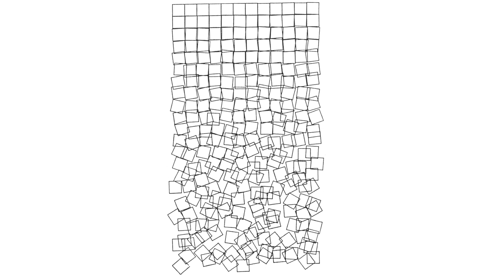

# Week 3 · Randomness and Data Flow

This week, let's discuss how randomness can aid a generative design process, and serve as the foundation for contemporary design opportunities. The focus this week will be on 2D patterns and generative art forms for *pedagogical* reasons, though the topics covered will serve frequently as both generative tools proper as well as for testing, data analysis, and aesthetic experimentation purposes.

-----

### References for the Week

Nearly all generative design works feature some degree of seeded, structured randomness. 

- [Fast Company article on Randomness in Design and Architecture](https://www.fastcompany.com/3052333/the-value-of-randomness-in-art-and-design)
- [Pitchfork Interview with Generative Music/Art Pioneer Brian Eno](https://pitchfork.com/features/interview/10023-a-conversation-with-brian-eno-about-ambient-music/)
- [Spotlight on Generative Artist Manolo Gamboa Naon](https://www.artnome.com/news/2018/8/8/generative-art-finds-its-prodigy)
- [Mischer Traxler](http://mischertraxler.com/projects/)
- [Simon Heijdens](http://www.simonheijdens.com/indexbig.php)
- [Snarkitechture](http://www.snarkitecture.com/drift/)
- [Interactive Generative Music Tool](https://teropa.info/loop/#/inc)
- [Another Generative Music Tool](https://sonant.generated.space)
- [Kenny Verbeeck on Randomness as Generative Design Tool](Verbeeck.pdf)
- [Kadenze Free Generative Art Certificate in 9 Hours(!?)](https://www.kadenze.com/courses/introduction-to-generative-arts-and-computational-creativity/info)

In non-generative design contexts, these same approaches were also especially evident in the [procedural design movement of the mid-aughts](https://www.ecal.ch/en/1181/events/exhibitions/low-tech-factory).

- [Glithero](http://www.glithero.com/work)
- [Maarten Baas](http://maartenbaas.com)

-----

### Randomness in Design

Computational randomness is a philosophically and technically complicated topic, with much disagreement and confusion amongst experts as well as amongst different academic disciplines.

To understand randomness for our design purposes, we need to acknowledge that randomness is *inhuman*. We have no ability to produce real randomness, and we can not even prove whether or not *any series of numbers* is random. Likewise, no computational tool we use can be truly random. In fact, were you able to [generate a method for truly random numbers](https://en.wikipedia.org/wiki/Random_number_generation), you would be one of the greatest inventors of all time — as you would have revolutionized [cryptography](https://www.design-reuse.com/articles/27050/true-randomness-in-cryptography.html), [AI and machine learning](https://ai.stackexchange.com/questions/15590/is-randomness-necessary-for-ai), and [human culture](https://en.wikipedia.org/wiki/History_of_randomness) in general. No biggie. As it stands, we have to rely on slightly [less-than-elegant approximations](https://blog.cloudflare.com/lavarand-in-production-the-nitty-gritty-technical-details/) if we want any semblance of true unpredictability in our design works.

##### Lava Lamp random number generators

Yet, though we can't generate randomness, the world exhibits *apparent* randomness everywhere. And, as designers, we often need to confront and probe that randomness as a modelable and definable input into our design research process. Users behave randomly in many situations, they are sized and shaped in random combinations, they live in random locales and have unpredictable reactions to stimuli... We often, fundamental to our design discipline, are tasked with investigating this randomness and tamping its complexity down into a set of digestable patterns or categories for our clients, our partners, and ourselves. This is one of our core competencies — reducing and structuring apparent complexity.

Because generative design is fundamentally driven by the productive friction between a *controlling* algorithm and an *uncontrollable* set of inputs, fully understanding randomness is a powerful tool. At a tactical level, [random data](http://mockaroo.com) can be used to model the variability of our users and their behaviors. Similarly, random values can help test if the boundaries of an algorithm are fully considered, and will often [reveal startling combinations](https://en.wikipedia.org/wiki/Genetic_algorithm) that we might not ever otherwise consider. 

##### Randomly-evolved beetles [based](https://www.cunicode.com/works/confusing-coleopterists) on 18th century scientific illustrations

In many ways, a randomness-driven approach may seem fundamentally opposed to contemporarily-elevated *data-driven* approaches, which will be the focus for much of the rest of the course. But, the same tools and approaches that allow us to play with randomness also often permit real data once it is collected and available. So, randomness can be fundamentally generative, it can serve as a *hypothetical* placeholder, and it can also help us evaluate the expressiveness of our designed outcomes.

-----

### Types of *Aleatory* Randomness

Set-theory randomness, or the *predictability of the next element in a series*, can be [categorized](https://en.wikipedia.org/wiki/Random_number_generation) as follows. Note that the examples are simply didactic, and will not survive any real mathematical scrutiny.

- Non-Random: Every element in the series is entirely predictable
	- 1, 2, 3, 4, 5...
	- 1, 1, 2, 3, 5...
	- 2, 4, 6, 8, 10...

- [Pseudo-Randomness (Seeded Randomness)](https://en.wikipedia.org/wiki/Pseudorandom_number_generator): Given a series of inputs, an *effectively* unrelated outcome will result in the series for each input. The same input will always yield the same output, though a study of different inputs will never reveal a *consistent* relationship between different inputs and their associated outputs.
	- Seeds: 4, 1, 6, 4, 3... -> Outputs: 9.213, 3.532, 4.089, 9.213, 5.652 

- Initial Condition Randomness: A starting state is defined, and then effective randomness ensues — though outcomes are fundamentally constrained by that initial condition. Imagine a bunch of spheres rolling down a rocky mountain — the final resting point of each sphere is random, though it will be related somewhat to where the sphere started. 
	- Start: 3 -> Outputs: 2, 9, 5
	- Start: 27 -> Outputs: 72, 17, 63
	- Start: .06 -> Outputs: .09, .04, .03

- True Randomness (Environmental Randomness): There is no consistent relationship between any number in the series and any other number in the series. Neither humans nor machines can generate true randomness — though we certainly [have tried](http://www.lavarand.org)!
	- Life ([Maybe?](https://en.wikipedia.org/wiki/Determinism))

Consult this [plain language explainer](http://www.statisticsblog.com/2012/02/a-classification-scheme-for-types-of-randomness/) for more info and a slightly different classification system. An understanding of these taxonomies is especially important for generative design, as an appropriate choice of randomness will often determine how useful any implementation is to a given generative design goal.

-----

### Grasshopper Definitions

Let's get better at handling lists of data and randomness in Grasshopper by creating some generative art featuring controlled randomness. In particular, focus on the use of *range* and *series* nodes this week, both of which are used to generate streams of numbers. 

#### After Peter Saville 

Best known for adorning Joy Division's *excellent* [Unknown Pleasures](https://en.wikipedia.org/wiki/Unknown_Pleasures) (which you should [absolutely listen to](https://open.spotify.com/album/0cbpcdI4UySacPh5RCpDfo) while working in Grasshopper), the graphic artists/designer [Peter Seville](https://en.wikipedia.org/wiki/Peter_Saville_(graphic_designer)) was one of the earliest implementors of generative and data-driven art approaches for mass audiences. He fundamentally defined the aesthetic of [New Wave](https://en.wikipedia.org/wiki/New_wave_music) through his posters, album covers, and motion graphics — and is the direct ancestor of contemporary [vaporwave](https://en.wikipedia.org/wiki/Vaporwave) aesthetics. 

Though this famous record cover is [based on real astronomical data](https://www.rollingstone.com/music/music-news/joy-divisions-unknown-pleasures-cover-the-science-behind-an-image-191126/), we will model our interpretation with controlled randomness in Grasshopper.

[Download](unknown-pleasures-definition.gh)

#### After George Nees

One of the famous "3N" [pioneers of computer graphics](https://centerprode.com/ojit/ojit0101/coas.ojit.0101.02013g.pdf), the German artist [George Nees](https://en.wikipedia.org/wiki/Georg_Nees) was an early implementor and codifier of computer graphics and drawing machines as viable methods of artistic expression. His innovations in algorithmic thinking directly seeded the aesthetics for many disciplines such as computer animation and immersive environments, and his work in definiting *dataesthetics* was a huge inspiration for [Syd Mead](https://www.nytimes.com/2020/01/03/arts/design/syd-mead-dead.html), who himself is largley responsible for the enduring style of sci-fi imagery.

One of Nees' most famous works is Cubic Disarray (shown above), which we will emulate in Grasshopper.

[Download](cubic-disarray-definition.gh)

#### After Vera Molnar / Jared Tarbell

Let's experiment with randomness to produce geometric patterns inspired by the works of [Molnár](http://www.veramolnar.com) and [Tarbell](http://www.complexification.net/gallery/), two extraordinary generative artists who work with controlled randomness towards new definitions of aesthetics.

[Download](random-pattern-definition.gh)

-----

### Homework

To be determined based on class progress.
