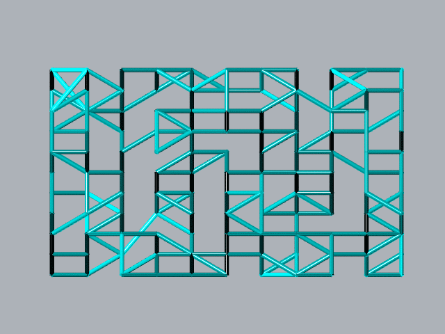
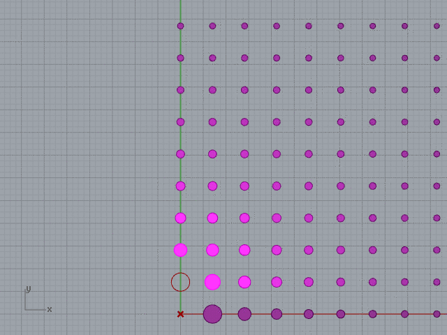
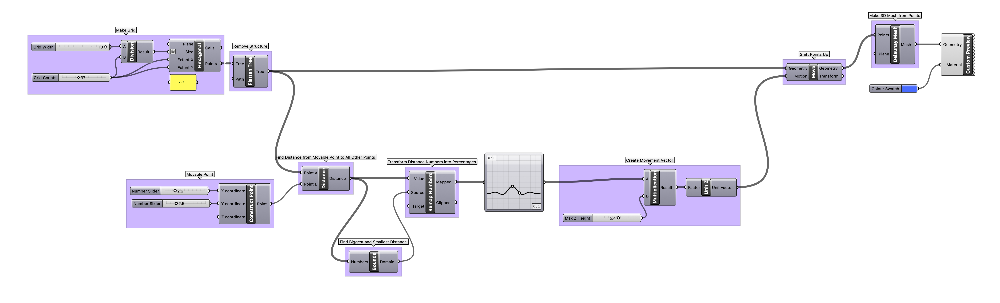
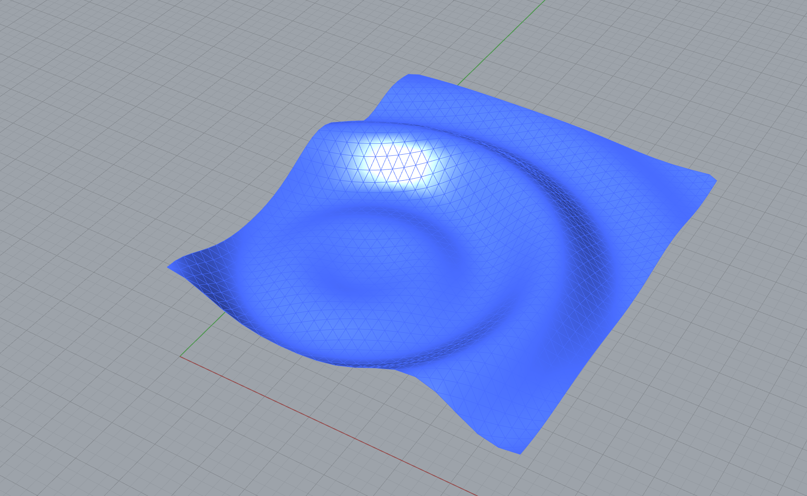
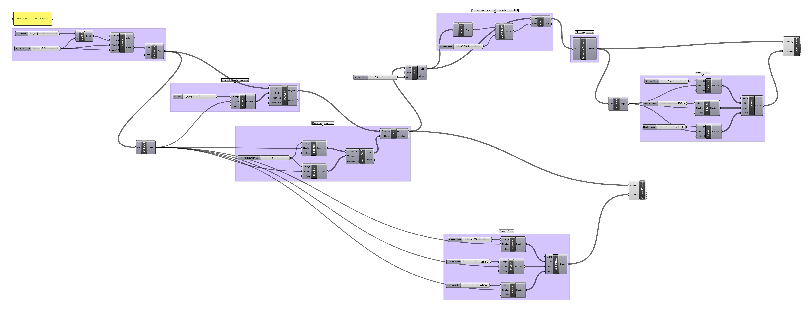

# Week 4 · Grids as Data Scaffolds

This week, we will take a look at how generative designers can use the regularity and structures of grids and related data scaffolds to seed their design work.

-----

### References for the Week

- [Red Blob Games on Grids](http://www-cs-students.stanford.edu/~amitp/game-programming/grids/)
- [Red Blob Games on Hex Grids](https://www.redblobgames.com/grids/hexagons/)
- [Quasicrystals](https://en.wikipedia.org/wiki/Quasicrystal)
- [Penrose Tiling](https://en.wikipedia.org/wiki/Penrose_tiling)
- [Geometric Honeycomb](https://en.wikipedia.org/wiki/Honeycomb_(geometry))
- [Beta-Skeletons](https://en.wikipedia.org/wiki/Beta_skeleton)
- [Islamic Patterns](https://patterninislamicart.com/drawings-diagrams-analyses)
- [Convex Hulls](https://en.wikipedia.org/wiki/Convex_hull)
- [*Rule of Six*](http://arandalasch.com/works/rules-of-six/) by Aranda Lasch
- [Algorithmic Patterns for Façade Design](apfd.pdf) by Inês Caetano
- [Paneling methods on complex surfaces](http://www.gasathj.com/tiki-read_article.php?articleId=31) by Matteo Codignola & Vito Sirago
- [Process(ing): Generative Irregular Grid](https://medium.com/@mishaheesakkers/process-ing-generative-irregular-grid-8f0d712dfaa4) by Misha Heesakkers
- [Sand Glyphs](https://inconvergent.net/generative/sand-glyphs/) by Inconvergent (Anders Hoff)
- [Seed Cathedral](http://www.heatherwick.com/project/uk-pavilion/) by Thomas Heatherwick
- [Geometricism](http://geometricism.com) by David Wade
- [Esther Stocker](https://www.sightunseen.com/2010/02/esther-stocker-artist/)

-----

### Scaffolds — Grids, Sampling, and Paneling

In the same way as last week's lessons asked you to draw your attention to the *range* node through a conversation about the exciting and quasi-mystical *random* node, this week will mask the importance of the *remap* node in the excitement of regular and irregular grid scaffolds and *closest point* sets.

Many methods exist to organize a *field of points* into structured sets. Many generative design works make use of such ordering and sequencing structures to place data entitites into legible positions, sample the differential impact of simulated physical forces on an area or volume, and otherwise provide the raw materials for later manipulation and deformation. 

#### 2D (into ND) Grids

Grid structures allow for simple connections amongst a set of members *by grouping according to dimensional and axial relationships* and *proximity*. We often think of the *rows* and *columns* of grids as natively mapped to principle axes *x* and *y*, though these two-dimensional *square* grid structures can be transformed [without any data change](https://en.wikipedia.org/wiki/Graph_theory) into *radial*, *triangular*, *hexagonal*, *diamond*, or *staggered (brick)* schemata.

##### Patterns through Random Projection

Create a regular grid, and then randomly move each point upwards. Find closest points to each point, and draw a connecting line. As the upwards movement increases, so to does the disorder of the patterns that emerge. [Projection into perpendicular dimensions is weird!](https://en.wikipedia.org/wiki/Flatland) This example makes use of the super useful *convex hull* node, which expects a set of points and returns the outer boundary polygon.

[Download](projection-pattern-definition.gh)

##### Closest Points Walker

Draw lines *from* a single movable point *to* a number of nearest grid points, to simulate a virtual 'spider' traversing the grid. Also, color nodes in grid based on distance to spider.

[Download](walker-definition.gh)

##### Distance-Based Circles

Create a grid of circles, and use the distance from a single movable point to determine the circles' radii.

[Download](circles-definition.gh)

##### Attractor/Repulsor

Distort the organization of a grid of points with a single, movable point.

[Download](attractor+repulsor-definition.gh)

##### Deformable Mesh

Use a movable point to manipulate the geometry of a 3D mesh surface.

[Download](deformable-mesh-definition.gh)

##### Image Sampler

Extract brightness data from an image and create 3D [heightmaps](https://en.wikipedia.org/wiki/Heightmap).

[Download](image-sampler-definition.gh)

##### After Molnár and Tarbell

Let's experiment with randomness to produce geometric patterns inspired by the works of [Molnár](http://www.veramolnar.com) and [Tarbell](http://www.complexification.net/gallery/), two extraordinary generative artists who work with controlled randomness and grids towards new aesthetic definitions. Take a regular grid, place polygons at every node, and distort every aspect of the resulting composition including polygon vertex count, rotation, placement, overall distortion, stroke color, fill color, stroke thickness...

[Download](random-pattern-definition.gh)

-----

### Homework

##### Grasshopper (1.5 hours)

TBD based on how far we get today! The likley homework will be to reconstruct all of the examples on this page that we did not cover.

##### Listening and Watching I (.5 hours)

Read a short case-study by Sidewalk Lab describing their neighborhood design tool: [*A first step toward the future of neighborhood design*](https://www.sidewalklabs.com/blog/a-first-step-toward-the-future-of-neighborhood-design/) as well as this [short interview](https://www.youtube.com/watch?v=-SoqN4GBpTM) with Chicago-native architect Jeanne Gang. If interested, you can read more about *Solar Carve* on [Studio Gang's website](https://studiogang.com/project/40-tenth-ave). All these pieces discuss how generative design tools allow creators to embed a non-human intelligence about ambient phenomena into their designed outcomes.

We will soon be exploring combinatorial design and more data-oriented generative approaches, so hopefully these teasers will be inspirational despite their location in urban planning and architecture rather than traditional design.

##### Listening and Watching II (1 hour)

Moving laterally a bit, but relating to our dive into generative music last week, let us investigate works in *generative literature* and *poetry*.

First, visit [curated.ai](http://curatedai.com) and read through some of the poems hosted there. Please do not visit the "about" page until later.

Then, read through this recent New Yorker article on generative literature: [What Happens When Machines Learn To Write Poetry](https://www.newyorker.com/culture/annals-of-inquiry/the-mechanical-muse). Following that, read this short introduction to *curated.ai* at Popular Science [Artificial Intelligences Are Writing Poetry For A New Online Literary Magazine](https://www.popsci.com/ai-poetry-literary-magazine/). 

I hope we can have a robust argument about whether this is amazing, or terrible, next week. :confused:

##### Visualization Practice (1 hour, spread out over week)

Take a look at the Dear Data week forty-six on *Books We Own* in preparation for next week. Through the week, construct a dataset for your own visualization purposes on a set of related content items that you own (not necessarily books -- consider real and digital possessions such as videogames, movies, collectibles, tableware...), and produce 3 visualizations on 5"x7" carts. Explore both 2D and 3D visualization opportunities, and prepare to share these with your peers. Crayons, color pencils, and play-doh are available in the faculty corridor on Zach's desk. Add a legibility key to the backs of all visualizations, and bring these in to share next week.

##### Catching Up

Please continue to submit homework from the last several weeks, if you have not already, into the appropriate folders in the class Google Drive.
