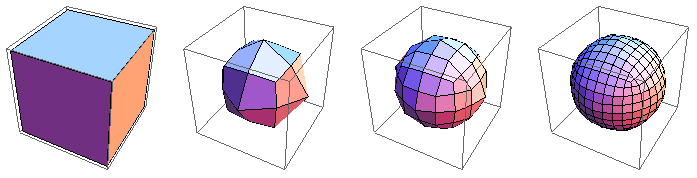
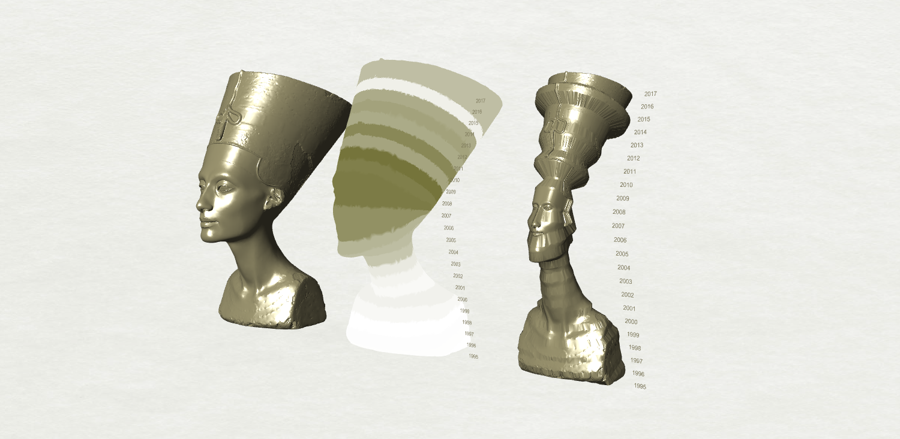

# Week 7 · Mesh Construction

Let us spend some time analyzing how 3D meshes are put together, as some of the most exciting approaches in generative design are built on hacking these fundamental 3D representational structures. 

-----

### Mesh Sources

- [Google Poly](https://poly.google.com/)
- [Turbo Squid](https://www.myminifactory.com/scantheworld/)
- [GrabCAD](https://grabcad.com/)
- [MeshMixer](http://www.meshmixer.com/)

-----

### Vertices -> Edges -> Faces -> Meshes

 

##### From the excellent [Mr. Div](https://mrdiv.tumblr.com)

A 3D mesh is file a simple data structure. At its heart are four geometric entitites.

- Vertex (often called 'vees' or 'verts' :rage:) · A point in 3D space
- Edge (sometimes in aggregate called 'loops') · A 2D connection between two vertices. Often, these are left out and can be inferred
- Triangular Face (always 'tris')· A collection of three vertices defining a triangular surface (always planar)
- Quadrangular Face (always 'quads' or 'queues') · A collection of four vertices defining a quadrilateral surface (planar or twisted)

Additionally, faces have additional properties that can sometimes be left out or inferred.

- Normal · A vector perpendicular to a face, defining its *outside*
- Winding · The ordering of the faces, *clockwise* or *counter-clockwise*
- Texture Coordinates · How the vertices of the face should relate to *pixel values* of an image that is designed to cover the 3D mesh.

These data entities are coded explicitly in 3d files. Here are the contents of a simple 'wavefront' .obj file. You would find similar contents in an .stl 'stereolithography' file or many other filetypes, which structure the same data similarly.

```
# Rhino

v 0 1 0
v 1 2 0
v 1 2.220446049250313e-16 0
v 2 1 0
f 4 2 1
f 4 1 3
```

The first line is a comment, which by convention names the program that created the file.

The following lines beginning with "v" are vertex coordinates, and refer to position in 3D space. Note the weird decimal number, due to a tolerance error from Rhino.

The final lines beginning with "f" are triangular faces. The integers that follow are *indices* of vertices, starting confusingly at 1. The indices are wound, by .obj convention, *counter-clockwise*, which means we do not need to notate the normals of these faces to define their directionality.

The file itself defines a singular 3D mesh, which looks like this:


-----

### Learning about Meshes : Nefertiti Hack


Take a look at this [fantastically controversial endeavor](http://nefertitihack.alloversky.com) by German artists Nora Al-Badri and Jan Nikolai Nelles to [digitally repatriate](https://ncph.org/history-at-work/repatriation-and-decolonization/) a famous bust of Queen Nefertiti excavated from Egypt and now located in the [Neues Museum in Berlin](https://www.smb.museum/en/museums-institutions/neues-museum/collections-research/about-the-collection.html). Even the [controversy is controversial](https://hyperallergic.com/281739/could-the-nefertiti-scan-be-a-hoax-and-does-that-matter/). 

Download a [simplified verison of this mesh](nefertiti-95reduced.obj) to peek at as a class.

BTW: [Others are continuing](https://www.myminifactory.com/scantheworld/) this initiative for other museum artefacts!

-----

### Catmull Clark Subdivision



Continuing from our work last week, meshes work very naturally with algorithmic processes. For example, [Catmull Clark Subdivision](https://en.wikipedia.org/wiki/Catmull–Clark_subdivision_surface) is amazing! This algorithm, developed by Pixar engineer-turned-President [Edwin Catmull](https://en.wikipedia.org/wiki/Edwin_Catmull) and author of [Creativity, Inc.](https://www.amazon.com/Creativity-Inc-Overcoming-Unseen-Inspiration-ebook/dp/B00FUZQYBO) and his friend and colleague [Jim Clark](https://en.wikipedia.org/wiki/James_H._Clark), the founder of Netscape and inventor of several critical 3D rendering technologies for animation, cinema, and video games.

The Catmull-Clark subdivision is a simple, iterative process.

- Take each edge of a 3d mesh
- Split each edge and create a new vertex at the center of each face, and connect the new vertex to all the split edges
- Find the average coordinates of the original vertex, the face center vertex, and the split edge vertex
- Move the original vertex to this new, average coordinate and rebuild the mesh

The resulting forms are more *continuous* that the original mesh, with any harsh edges smoothed out. The one flaw is that the new mesh is inherently *heavier*: it has significantly more face and vertices. The characteristic aesthetic of Pixar films, which has directly inspired most other 3D animation companies, is [fundamentally due to the Catmull-Clark algorithm](https://graphics.pixar.com/library/Geri/paper.pdf).


Play with Pixar in a Box's amazing [interactive tool](https://www.khanacademy.org/partner-content/pixar/modeling-character/modeling-subdivision/p/interactive-subdivision-in-3d)) to get a feel for this simple but surprisingly powerful algorithm.

-----

### Grasshopper Mesh Manipulation

Let's take a look at how the Nefertiti mesh is constructed as an exemplar of mesh data, and learn a bit about how its simple mesh data structure can be algorithmically manipulated to represent the effects of attraction, repulsion, and other physical forces. Take a look at [Rayfire 3D](https://www.youtube.com/watch?v=dzOhI-H3pSk), a generative design tool for cinematic effects production, that implements similar mesh manipulation methods.

[Download](deform-definition.gh)


-----

### Grasshopper Data Forms

Is the Nefertiti mesh, as a crystallization of many of the issues resulting from historic and contemporary colonialism, carry potential messaging value for generative designers?

As we [lack data](https://en.wikipedia.org/wiki/Repatriation_(cultural_heritage)) on global repatriation, perhaps we can move to an adjacent and related space: [tourism to Egypt](https://data.worldbank.org/indicator/ST.INT.ARVL?locations=EG) and its [impact on local populations, the environment, and the very historic artefacts that often drive tourism](https://en.wikipedia.org/wiki/Impacts_of_tourism).

Intended as a more visceral communicator of the [complex](https://en.wikipedia.org/wiki/Terrorism_and_tourism_in_Egypt) and [problematic relationship](https://foreignpolicy.com/2018/10/19/the-tourism-curse/) between many countries and their tourism industries, each model below shows the number of tourists entering Egypt from abroad -- 'blindfolding' Queen Nefertiti in the middle model with data and 'squeezing' her in the right model. Are any of these models effective and provocative communicators despite their lack of traditional data visualization legibility, or do they simply appear to be weird [glitch art](https://en.wikipedia.org/wiki/Glitch_art)? 

[Download](tourism-definition.gh)




-----

### Homework

#### Food 4 Rhino Research


[Food4Rhino](http://www.food4rhino.com) is a central repository for plugins and add-on software for Rhino 3D, as well as for Grasshopper. Plugins for plugins! 

Create a free account on the website and search around. Anything exciting? Unfortunately, not everything will work on Macs and it's impossible to know unless you see an Apple logo under the *Download* button. But, even if *there is not an Apple logo*, it still might work!

To install a Grasshopper plugin, open Grasshopper, and navigate to File -> Special Folders -> Components Folder.

This will open a Finder/Explorer window, into which you can move the downloaded files. Sometimes, you'll get a single file, and other times, you'll get whole folders. In that latter case, the best practice is usually to drag the entire downloaded folder over. You can find Grasshopper plugins all over the internet, not just at Food4Rhino. If you are running Windows, right click on any .exe, .ghuser, and .gha files and click on *Properties*. Make sure to click *Unblock* if it is an option.

For Grasshopper to load newly installed plugins, we need to **restart** Rhino and Grasshopper. 

For future exercises, please install a few essential plugins.

- For better Mesh cleanup: [Mesh Edit Tools *2*](https://www.food4rhino.com/app/meshedit)

- For powerful geometric manipulation: [Lunchbox *2017.8.1 ZIP*](https://www.food4rhino.com/app/lunchbox#)

Research the site, and see what might be out there! 

##### Preparing for Briefs - References and Proposals for In-Class Review

As we approach our mid-semester break, we will soon be moving into having class time dedicated to individual projects and outcome-oriented tutorials. Yet to be covered is [evolving designs](https://medium.com/generative-design/evolving-design-b0941a17b759), [physics simulation with Kangaroo](https://vimeo.com/user798992), [recursive growth algorithms](https://inconvergent.net/generative/), and various digital fabrication options -- which will be introduced in the first few weeks of B-Session.

After these lessons, aside from some scattered triage tutorials, classtime during B-Session will be available to you as worktime for research, modeling, and preparing files for printing or fabrication. Some additional online tutorials will be recommended weekly, but generative design competencies are best developed through the struggle with the tools toward passionately desired outcomes.

So, let's define some outcomes in our [formal brief](../briefs.md)! 

##### Submit Work

Please submit any old homework into the appropriate folders in the class Google Drive.