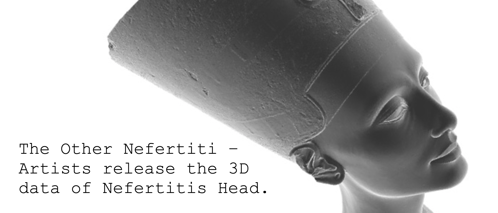

SUBSTRATE???

#### Data-Driven Delaunay Cast

Create a Delaunay triangulation in 3D space around a data-driven, anatomical form.

[Download](delaunay-cast-definition.gh)

-----

#### Catmull Clark Subdivision

[Catmull Clark Subdivision](https://en.wikipedia.org/wiki/Catmull–Clark_subdivision_surface) is amazing! This algorithm, developed by Pixar engineer-turned-President [Edwin Catmull](https://en.wikipedia.org/wiki/Edwin_Catmull) and author of [Creativity, Inc.](https://www.amazon.com/Creativity-Inc-Overcoming-Unseen-Inspiration-ebook/dp/B00FUZQYBO) and his friend and colleague [Jim Clark](https://en.wikipedia.org/wiki/James_H._Clark), the founder of Netscape and inventor of several critical 3D rendering technologies for animation, cinema, and video games.

The Catmull-Clark subdivision is a simple, iterative process.

- Take each edge of a 3d mesh
- Split each edge and create a new vertex at the center of each face, and connect the new vertex to all the split edges
- Find the average coordinates of the original vertex, the face center vertex, and the split edge vertex
- Move the original vertex to this new, average coordinate and rebuild the mesh

The resulting forms are more *continuous* that the original mesh, with any harsh edges smoothed out. The one flaw is that the new mesh is inherently *heavier*: it has significantly more face and vertices. The characteristic aesthetic of Pixar films, which has directly inspired most other 3D animation companies, is [fundamentally due to the Catmull-Clark algorithm](https://graphics.pixar.com/library/Geri/paper.pdf).

Play with Pixar in a Box's amazing [interactive tool](https://www.khanacademy.org/partner-content/pixar/modeling-character/modeling-subdivision/p/interactive-subdivision-in-3d)) to get a feel for this simple but surprisingly powerful algorithm.

-----

### Food 4 Rhino Downloads

[Food4Rhino](http://www.food4rhino.com) is a central repository for plugins and add-on software for Rhino 3D, as well as for Grasshopper. Plugins for plugins! 

Create a free account on the website and search around. Anything exciting? Unfortunately, not everything will work on Macs and it's impossible to know unless you see an Apple logo under the *Download* button. But, even if *there is not an Apple logo*, it still might work!

To install a Grasshopper plugin, open Grasshopper, and navigate to File -> Special Folders -> Components Folder.

This will open a Finder/Explorer window, into which you can move the downloaded files. Sometimes, you'll get a single file, and other times, you'll get whole folders. In that latter case, the best practice is usually to drag the entire downloaded folder over. You can find Grasshopper plugins all over the internet, not just at Food4Rhino. If you are running Windows, right click on any .exe, .ghuser, and .gha files and click on *Properties*. Make sure to click *Unblock* if it is an option.

For Grasshopper to load newly installed plugins, we need to restart Rhino and Grasshopper. 

For this and future exercises, let's install a few essential plugins.

- For better Mesh cleanup: [Mesh Edit Tools *2*](https://www.food4rhino.com/app/meshedit)

- For powerful geometric manipulation: [Lunchbox *2017.8.1 ZIP*](https://www.food4rhino.com/app/lunchbox#)

-----

#### Learning about Meshes : Nefertiti and Mesh Deformation

Take a look at this [fantastically controversial endeavor](http://nefertitihack.alloversky.com) by German artists Nora Al-Badri and Jan Nikolai Nelles to [digitally repatriate](https://ncph.org/history-at-work/repatriation-and-decolonization/) a famous bust of Queen Nefertiti excavated from Egypt and now located in the [Neues Museum in Berlin](https://www.smb.museum/en/museums-institutions/neues-museum/collections-research/about-the-collection.html). Even the [controversy is controversial](https://hyperallergic.com/281739/could-the-nefertiti-scan-be-a-hoax-and-does-that-matter/). 

Let's take a look at how a mesh is constructed, and learn a bit about how they can be algorithmically manipulated.

[Download](deform-definition.gh)

[Others are continuing](https://www.myminifactory.com/scantheworld/) this initiative for other museum artefacts!

-----