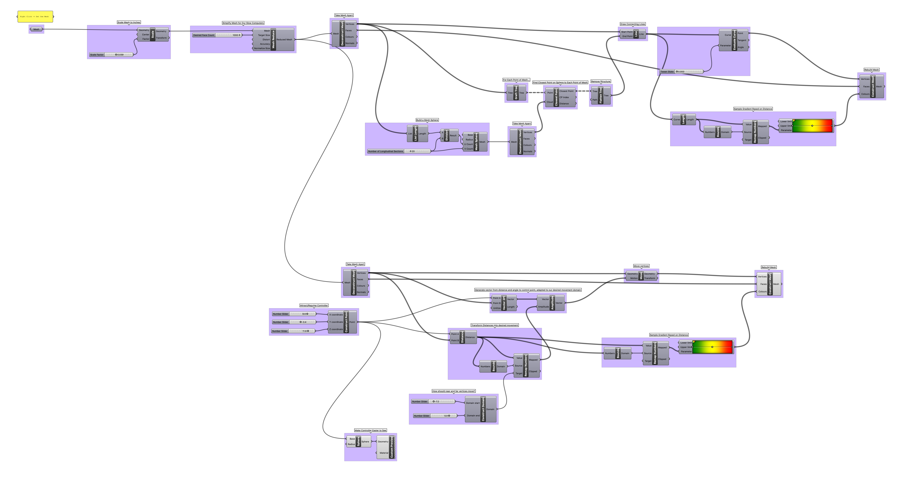

# Week 7 Part A · Meshes

Let us spend some time analyzing how 3D meshes are put together, as some of the most exciting approaches in generative design are built on hacking these fundamental 3D representational structures. 

-----

### Mesh Sources

- [Google Poly](poly.google.com)
- [Turbo Squid]()
- [GrabCAD]()

-----

### Vertices -> Edges -> Faces -> Meshes

 

##### From the excellent [Mr. Div](https://mrdiv.tumblr.com)

A 3D mesh is file a simple data structure. At its heart are four geometric entitites.

- Vertex (often called 'vees' or 'verts' :rage:) · A point in 3D space
- Edge (sometimes in aggregate called 'loops') · A 2D connection between two vertices. Often, these are left out and can be inferred
- Triangular Face (always 'tris')· A collection of three vertices defining a triangular surface (always planar)
- Quadrangular Face (always 'quads' or 'queues') · A collection of four vertices defining a quadrilateral surface (planar or twisted)

Additionally, faces have additional properties that can sometimes be left out or inferred.

- Normal · A vector perpendicular to a face, defining its *outside*
- Winding · The ordering of the faces, *clockwise* or *counter-clockwise*
- Texture Coordinates · How the vertices of the face should relate to *pixel values* of an image that is designed to cover the 3D mesh.

These data entities are coded explicitly in 3d files. Here are the contents of a simple 'wavefront' .obj file. You would find similar contents in an .stl 'stereolithography' file or many other filetypes, which structure the same data similarly.

```
# Rhino

v 0 1 0
v 1 2 0
v 1 2.220446049250313e-16 0
v 2 1 0
f 4 2 1
f 4 1 3
```

The first line is a comment, which by convention names the program that created the file.

The following lines beginning with "v" are vertex coordinates, and refer to position in 3D space. Note the weird decimal number, due to a tolerance error from Rhino.

The final lines beginning with "f" are triangular faces. The integers that follow are *indices* of vertices, starting confusingly at 1. The indices are wound, by .obj convention, *counter-clockwise*, which means we do not need to notate the normals of these faces to define their directionality.

The file itself defines a singular 3D mesh, which looks like this:


-----

### Learning about Meshes : Nefertiti Hack


Take a look at this [fantastically controversial endeavor](http://nefertitihack.alloversky.com) by German artists Nora Al-Badri and Jan Nikolai Nelles to [digitally repatriate](https://ncph.org/history-at-work/repatriation-and-decolonization/) a famous bust of Queen Nefertiti excavated from Egypt and now located in the [Neues Museum in Berlin](https://www.smb.museum/en/museums-institutions/neues-museum/collections-research/about-the-collection.html). Even the [controversy is controversial](https://hyperallergic.com/281739/could-the-nefertiti-scan-be-a-hoax-and-does-that-matter/). 

Download a [simplified verison of this mesh](nefertiti-95reduced.obj) to peek at as a class.

BTW: [Others are continuing](https://www.myminifactory.com/scantheworld/) this initiative for other museum artefacts!

-----

### Catmull Clark Subdivision


Continuing from our work last week, meshes work very naturally with algorithmic processes. For example, [Catmull Clark Subdivision](https://en.wikipedia.org/wiki/Catmull–Clark_subdivision_surface) is amazing! This algorithm, developed by Pixar engineer-turned-President [Edwin Catmull](https://en.wikipedia.org/wiki/Edwin_Catmull) and author of [Creativity, Inc.](https://www.amazon.com/Creativity-Inc-Overcoming-Unseen-Inspiration-ebook/dp/B00FUZQYBO) and his friend and colleague [Jim Clark](https://en.wikipedia.org/wiki/James_H._Clark), the founder of Netscape and inventor of several critical 3D rendering technologies for animation, cinema, and video games.

The Catmull-Clark subdivision is a simple, iterative process.

- Take each edge of a 3d mesh
- Split each edge and create a new vertex at the center of each face, and connect the new vertex to all the split edges
- Find the average coordinates of the original vertex, the face center vertex, and the split edge vertex
- Move the original vertex to this new, average coordinate and rebuild the mesh

The resulting forms are more *continuous* that the original mesh, with any harsh edges smoothed out. The one flaw is that the new mesh is inherently *heavier*: it has significantly more face and vertices. The characteristic aesthetic of Pixar films, which has directly inspired most other 3D animation companies, is [fundamentally due to the Catmull-Clark algorithm](https://graphics.pixar.com/library/Geri/paper.pdf).


Play with Pixar in a Box's amazing [interactive tool](https://www.khanacademy.org/partner-content/pixar/modeling-character/modeling-subdivision/p/interactive-subdivision-in-3d)) to get a feel for this simple but surprisingly powerful algorithm.

-----

### Grasshopper Mesh Manipulation

Let's take a look at how the Nefertiti mesh is constructed as an exemplar of mesh data, and learn a bit about how the simple structure can be algorithmically manipulated.

[Download](deform-definition.gh)



