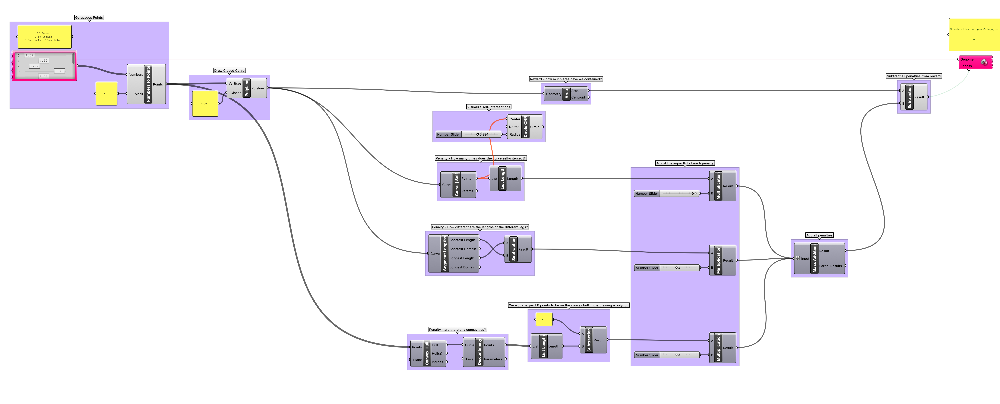
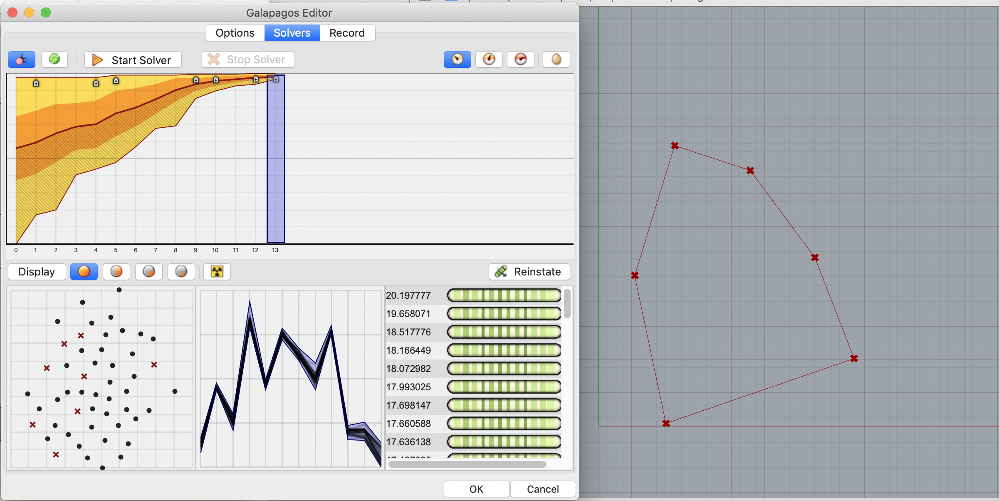
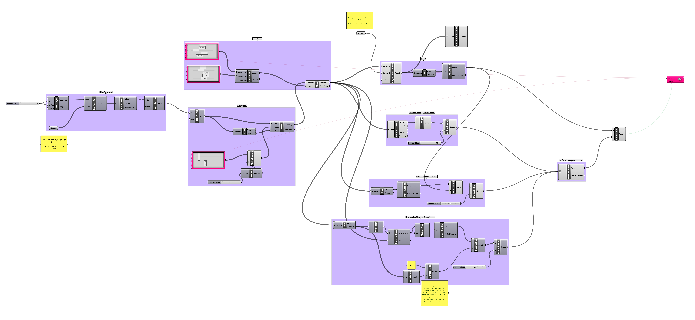
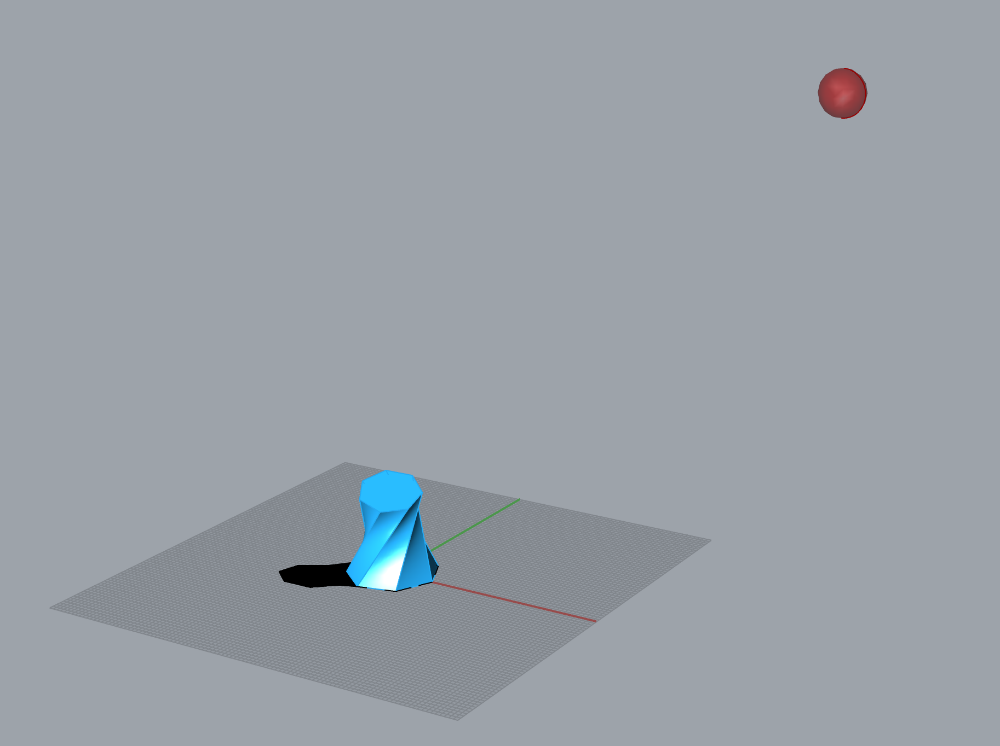
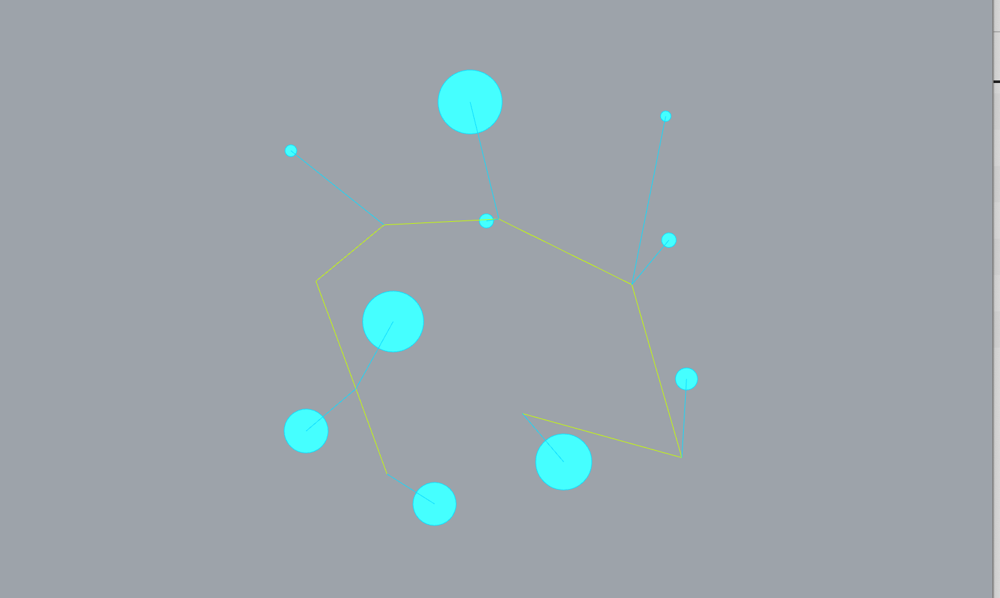

# Week 8 · Evolutionary Forms and Genetic Algorithms

### Agenda

- Check-In
- Coronavirus + Data Visualization/Literacy
- Short Break
- Genetic Algorithms Intro
- Short Break
- Break-Out Exercise
- Short Break
- Q+A Review
- Next Steps for Projects

-----

#### Intro 

Let'e examine how naive [iterative 'AI' modeled on evolutionary genetic descent](https://en.wikipedia.org/wiki/Evolutionary_algorithm) can be integrated into the design process. Evolutionary modeling allows us to [biomimetically](https://en.wikipedia.org/wiki/Biomimetics) integrate the incredible methods that life itself has used over millenia to optimize itself to a tremendous diversity of environmental systems. Just like real world natural environments, generative designers can model a complex system as a set of rewards and punishments, and push various effectively random lifeforms (our designs!) through the system to see how each fares. Successful lifeforms pass their genes on, and struggling organisms and their genetics go extinct over time. [Mutation](https://en.wikipedia.org/wiki/Cancer) keeps things interesting and ensures lifeforms do not [*over-specify*](https://en.wikipedia.org/wiki/Adaptation) and become so *specific* that any environmental change would [lead to their demise without intervention](https://qz.com/1308730/modern-pandas-should-have-died-out-years-ago/), and the process repeats until a [*local optimum*](https://en.wikipedia.org/wiki/Local_optimum) is discovered. 

##### [Darwin's finches](https://en.wikipedia.org/wiki/Darwin%27s_finches)

These sorts of tools have recently been adopted, and increasingly are being accepted, in [public policy development](https://medium.com/@numanovicamar/https-medium-com-numanovicamar-data-science-the-next-frontier-for-data-driven-policy-making-8abe98159748) and [problem solving](https://ideas.repec.org/a/ssi/jouesi/v4y2017i3p364-379.html) as well as [urban planning discourse](https://www.researchgate.net/publication/32884865_Integrated_Urban_Evolutionary_Modeling) — opening up these disciplines to design methodology and systems thinking. Perhaps, evolutionary modeling might be explained as the computational version of system modeling and prediction?

This approach, fairly straightforward by generative design standards, unfortunately goes by many different names: evolutionary modeling, genetic algorithms, life simulation, etc... There are lots of exciting designers using these tools towards super fascinating ends.

Also, very importantly, play with [genetic cars](http://rednuht.org/genetic_cars_2/).

-----

### References for the Week

Some examples of evolutionarily modeled forms and solutions.

- [Evolving Floorplans](http://www.joelsimon.net/evo_floorplans.html)
- [Evolving Design by Danil Nagy](https://medium.com/generative-design/evolving-design-b0941a17b759)
- [Engine Block, Chair, Medical Implants](https://www.wired.com/2015/09/bizarre-bony-looking-future-algorithmic-design/)
- [Aesthetics of Simple 3D Form](https://agatakycia.com/2011/12/28/aesthetics-and-creativity-in-evolutionary-design/)
- [Yacht Geometry for Ideal Hydrodynamics and Displacement](http://www.cupinfo.com/en/americas-cup-automated-yacht-design-optimization.php)
- [Antennas for Unusual Environments](https://en.wikipedia.org/wiki/Evolved_antenna)
- [Beach Walking Animals](http://www.strandbeest.com)
- [Stadium Roof Design](https://www.youtube.com/watch?v=RQIXJMmm-0A)
- [Complex Joint Design](https://www.youtube.com/watch?v=wB-Q4erLMYE)
- [Shoes](https://vimeo.com/user2852610)
- [Solar Carve Tower](http://www.archdaily.com/806233/new-images-of-studio-gangs-solar-carve-tower-revealed-as-project-gets-underway)
- [Minimum Solar Exposure to Save Cooling Expense](https://yazdanistudioresearch.wordpress.com/2015/02/09/building-optimization-tools-the-grasshopper-definition-and-breakdown/)
- [Max Solar Exposure](https://gonzalesarch.wordpress.com/tag/grasshopper/)
- [Best Airflow and Heating for Poulty Facility](https://bioarchitecturestudio.com/2011/07/21/organic-farm-yard-pedregal-del-fresno-grasshopper-galapagos/)
- [College Quad Layout based on Desire Lines](http://isia.ir/semiology/)
- [Room Arrangement](http://omarohelmy.blogspot.com/2013/01/experiments-in-space-planning-using.html)
- [Room Arrangment 2](https://www.youtube.com/watch?v=SWyE3V6LKCc)
- [Awning Design](http://archi-lab.net/form-finding-with-grasshoppergalapagos/)
- [Building Layout and Window View Optimization](http://designplaygrounds.com/blog/view-optimization-using-galapagos-for-grasshopper/)
- [Trusses](http://golancourses.net/2013/projects/genetic-algorithm-optimal-trusses/)
- [Suspension Bridge Spans](https://iq.intel.co.uk/neural-networks-genetic-algorithms-computers-getting-creative/)
- [Wind Turbine Blade](https://www.youtube.com/watch?v=YZUNRmwoijw)
- [Learning to Stand](https://www.youtube.com/watch?v=lPQnVEnFTgY)
- [Learning to Walk](https://vimeo.com/85053197)
- [Learning to Walk and Survive Impact!](https://www.youtube.com/watch?v=pgaEE27nsQw)
- [Max Volume : Minimum Area](http://gracefulspoon.com/blog/2011/06/05/bucky-was-right)
- [Breeding Tables](http://www.kramweisshaar.com/projects/breeding-tables)
- [Assorted Examples](http://legacy.iaacblog.com/maa2013-2014-designing-associativity/)
- [Complete Architectural Design from Lot Orientation to Room Details](https://www.youtube.com/watch?v=3sM6qUUJxus)
- [Better Box Car 2D that Doesn't Require Flash](http://rednuht.org/genetic_cars_2/)
- [Motor Train](https://bib.irb.hr/datoteka/255484.383.pdf)
- [Locomotion System](http://www.demo.cs.brandeis.edu/golem/design.html)

-----

#### Evolutionary Algorithms

Any design challenge, once a certain level of precision is achieved, could be tackled through an evolutionary solver. All that is required is that the design challenge have a clear goal to minimize or maximize (the *fitness*), which is in some way *dependent* by the interplay between a set of variables (the *genome*).  But, certain kinds of design challenges will fit this approach best.

*Fitness* can be complex and synthesized from several factors, and the most productive fitnesses for evolutionary algorithms to solve for are those that implement two oppositional forces (3d volume and material use in a building, height and structural rigidity in a wind turbine, aerodynamics and fuel load in a rocket). In lifeforms the interplay is similar — bigness is great for overpowering and eating other animals, but if you're bigger, you need more calories to move around and maintain your body heat!

The more parameters that define the *genome*, the more varied and successful the outcomes *can* be, at the expense of computing time. Just like in living organisms, a healthy genome is defined by variability, specificity, and a lack of redundency -- and its appropriateness to its environment. 

Life has needed to adapt to both a changing [*fitness landscape*](https://en.wikipedia.org/wiki/Fitness_landscape) (climate change, weather patterns, competitive lifeforms over time) as well as remarkably diverse *fitness conditions* ([the open sea, the air, reefs, rainforest canopy, deserts](https://en.wikipedia.org/wiki/Biome)...) and as a result our planet offers remarkably diverse outcomes of specific local maxima solutions — which we call *species*. Note the [language overlap](https://www.etymonline.com/search?q=specific)! 

Design tools don't quite yet offer that amount of control and hyper-targeting, but perhaps [they soon will](https://www.sidewalklabs.com/blog/a-first-step-toward-the-future-of-neighborhood-design/)!

Also worth noting - genetic algorithms are a powerful *metaphor* for the design process. It is both whimsical yet expressive, procedural yet creative, quasi-spiritual and scientific at the same time. In Zach's personal design experience, it is by far the most enagaging generative design approach for clients, who nearly always smile when they think about a design solution *evolving* in front of their eyes. We might ask ourselves - what other concepts in evolutionary biology might be worthy models for future generative design tools? For example, might the phenomenon of [convergent evolution](https://en.wikipedia.org/wiki/Convergent_evolution) help us better articulate and model services and systems? Could [mutualistic relationships](https://en.wikipedia.org/wiki/Mutualism_(biology)) serve as a powerful exemplars of [iterative co-design](https://medium.com/@thestratosgroup/co-design-a-powerful-force-for-creativity-and-collaboration-bed1e0f13d46)?

-----

### Grasshopper Demo

Let's teach a computer to evolve polygons, as well as other simple geometry challenges. We will talk through this example as a group.

[Download](polygon-definition.gh)

-----

### Grasshopper Exercises

In Grasshopper, genetic algorithms are located in the *Galapagos* node. In small digital break-out groups, work together to build and discuss whichever of these examples we decide to complete. Collect your questions as you build, for later class discussion.

#### Nesting Shapes

Rotate and place weirdly shaped pieces into a boundary without overlapping and with minimal wasted margins. This logic is useful for [nesting forms for laser cutting](https://www.tdmsolutions.com/rhinonest/), building AIs for [tangrams](https://en.wikipedia.org/wiki/Tangram), or [pepakura](https://tamasoft.co.jp/pepakura-en/) crafting! 

[Download](tangram-definition.gh)

-----

#### Solar Carve

Minimize cast shadow but maximize volume. Take a look at Studio Gang's [Solar Carve Tower](http://www.archdaily.com/806233/new-images-of-studio-gangs-solar-carve-tower-revealed-as-project-gets-underway) to see these techniques applied.

[Download](solar-carve-definition.gh)

----

#### Railway Routing

Route a train line through a city to adequately serve population centers. This is a variation of a common mathematical puzzle, the [traveling salesman problem](https://en.wikipedia.org/wiki/Travelling_salesman_problem), which is a common mathematical model for many routing and navigation challenges. 

[Download](subway-definition.gh) (but please don't skip the rebuilding step in class!)

-----

### Homework

##### Grasshopper (1 hour)

Depends how our first online class gets! Likely to be something fun with Galapagos...

##### Final Project Development

Please come next week prepared to discuss your [initial ideas for our class brief](../briefs.md) through a set of 2D or 3D sketches, using whatever art and design tools you have available. Let Zach know if you need tools!

First, prepare real or [hypothetical data](https://www.mockaroo.com/), and create 20 sketches for how this data might *prompt*, *confront*, or *activate* behaviors in an audience. Yes, 20! We will share these in small groups next week, in digital break-out groups, so photograph or scan them before class. Please do not create a *key* on your scans or photographs, as we will begin by asking one another to try to *read* the data physicalizations without any aids.

Consider through these sketches posture (does the object draw attention to itself or try to disappear?), archetype (is it a teapot or an earring?), attitude (does the visualization scold or applaud?), ritual (how do we engage these objects through time?), and obviously content (what kind of data? how could the data be transformed?).

Super excited to see all the ideas! If you need some inspiration, hit the [best website on the planet for generative designers](http://dataphys.org/list/). It might be valuable to also start collecting inspirational and relevant projects, images, and datasets in evernote/pinterest/bookmark folder...

#### Visualization Logging

Create a bookmark folder and log all of the visualizations of Coronavirus that you encounter through the week, ideally from many different sources, so that we can chat next week about which are effective and legible, which teach, which mislead, and which provoke action and emotion. 

##### Submit Work

Please submit homework into the appropriate folders in the class Google Drive for this week - especially your ideas for the brief.
