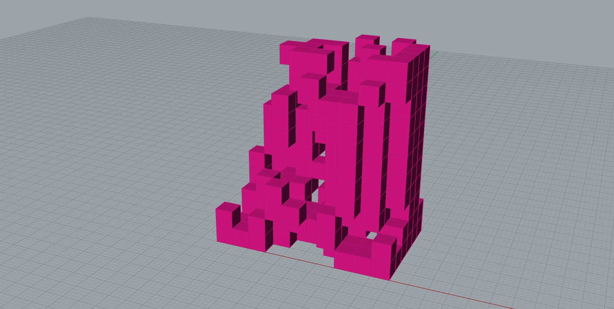

# Week 9 · Generative Algorithms and Grammars

### Agenda

- Check-In
- Follow-Up on Genetic Algorithms and Train Line Evolver HW
- Short Break
- Coronavirus + Data Visualization/Literacy
- Generative Algorithms and Grammars Intro
- Short Break
- Break-Out Sketch Reviews
- Short Break
- Plugin Install
- Q+A Review
- Next Steps


-----


### Follow Up

- [DataCamp's DataFramed](https://www.datacamp.com/community/podcast) on [Hysteresis and Uncertainty in Computational Modeling](https://www.datacamp.com/community/blog/uncertainty-data-science), [Five Thirty Eight Politics Podcast](https://fivethirtyeight.com/tag/politics-podcast/) on [Uncertainty and COVID-19](https://fivethirtyeight.com/features/politics-podcast-how-uncertainty-around-the-coronavirus-affects-our-life-and-politics/), and [Data Skeptic](https://dataskeptic.com) on [Visualizing Uncertainty](https://www.stitcher.com/podcast/data-skeptic-podcast/the-data-skeptic-podcast/e/68176782)
- Genetic Algorithms in Excel via [the built-In tools](https://www.youtube.com/watch?v=8JoYIooDhfE), [OpenSolver](https://opensolver.org), or [SolveXL](https://www.solvexl.com/free-trial.html).
- More Trains! 


-----


### Intro 


An emerging approach in contemporary design (one of the newest of the new!) is to implicate the intelligence of *growing* and *living* organisms into the design process. This type of design is the origin of the term [*generative*](https://www.etymonline.com/search?q=generate) design, though it has historically and in different disciplines been called *biomorphic modeling*, *structured grammars*, *automata modeling*, or *agent-based modeling*. 

Through this approach to modeling life and growth, we consider how a single *agent* with defined abilities and constraints, located in a world with defined rules and over a time period of defined ticks, would behave and react without any designer intervention. These agents might move as close as possible to something, avoid other things, move horizontally until they must move vertically, advance and then turn 20 degrees, seek goal locations, spread their attributes to neighbors, consume nearby things and grow bigger... straightforward rules like these that emulate the natural behaviors of simple organisms. When these straightforward rules are followed by *many agents* over *many generations* of individual decisions, the results can be shocking in their complexity and emergent intelligence. Commonly, the paths that these agents traverse are traced through time, and the resulting lines/regions become raw materials for designed outcomes. 

This methodology and logic has its roots in (and mostly has supplanted) the superficial [biomimicry](https://en.wikipedia.org/wiki/Biomimetics) that defined cutting edge design through much of the early aughts with proponents like [Janine Benyus](https://www.ted.com/talks/janine_benyus_shares_nature_s_designs?language=en), [Ross Lovegrove](https://www.google.com/search?client=safari&rls=en&q=rosslovegrove&ie=UTF-8&oe=UTF-8), and [Joris Laarman](https://www.jorislaarman.com). As a result of this reorientation, *generative* has supplanted *parametric*, *computational, and *biomimetic* as the label for this whole new branch of design approaches, and so now you all are enrolled in a class called *Generative Design Workshop*! Each generative alogrithm often carries its own language, metaphor, and *grammar* — an encoding system for sculpting agent behaviors.

It is important to introduce a warning at this point, however. These generative logics are attempts to *recreate* the intelligence of a living and growing, self-preserving organism at a *very simple* level. Despite even maximum simplicity, however, computers have a very hard time due to the [recursion](https://en.wikipedia.org/wiki/Recursion_(computer_science)) often required of generative algorithms. Living organisms have the ability to constantly re-evaluate their context and goals continuously over time. Semi-consistent motivations are applied at each evaluation, and transient decisions are made which are frequently altered and reconsidered. This reflexive and iterative analysis is very taxing on computers, which are designed to execute instructions in fixed order on known data. In fact, generative approaches are often impossible for functional and declarative programming languages to implement, as these languages cannot reference their own work until that work is completed. As a result, software tools for making use of generative modeling still require significant intervention at the programming level. Perhaps even more critically, due to the [combinatorial explosion](https://blog.datarobot.com/the-curse-of-dimensionality-combinatorial-explosions) that results through simulation steps, generative design is *slow* and *resource-intensive*. These algorithms are often rated in [Big O Notation](https://rob-bell.net/2009/06/a-beginners-guide-to-big-o-notation/), a measuring system used to describe iterative and complex mathematical problems.


Generative modeling is very much the opposite of the evolutionary modeling explored last week. Evolutionary modeling asks the designer to define the overarching goals of a system, and the components of the system are rearranged to optimize some parameter of the system. Generative modeling inverts this approach‚ and asks designers to define what the components of the system can do without the ability to sculpt a systemic goal. The system emerges from the behavior of the agents. Nevertheless, there is much in common between these two approaches in their justifications and methodologies.

Generative approaches offer so much potential to the contemporary data-driven designer and architect — as both research and solution-finding logics — for hopefully obvious reasons. Follow this space closely, and contribute to it! Today, we will look at several examples of generative algorithms.


-----


### References and Projects

Generative design is a very new model for architecture and design, having only emerged in the late 1980s and just now finding computational resources of adequate power to realize meaningful outcomes. There are, however, a few notable existing experiments that point to a future of *grown*, adaptive objects and structures.

- [Michael Hansmeyer](http://www.michael-hansmeyer.com/projects/l-systems.html?screenSize=1&color=1#7)
- [Aranda \ Lasch](http://arandalasch.com)
- [Nervous System](https://n-e-r-v-o-u-s.com)
- [National Stadium Beijing](https://www.herzogdemeuron.com/index/projects/complete-works/226-250/226-national-stadium/image.html)
- [Stuttgart Airport](http://www.gmp-architekten.com/projects/stuttgart-airport-terminal-3.html)
- [Funicular Structures in Architecture and Jewelery](http://www.grasshopper3d.com/forum/topics/envelop-of-lines-network-mesh-and-funicular-structures?groupUrl=kangaroo&groupId=2985220:Group:120977&id=2985220:Topic:1434822&page=2)
- [Alba Protein Folding Visualization and Pharmaceutical Development](http://www.ryanhoover.org/rd/alba.php)
- [Autopoetic Architecture of Patrik Schumacher](http://www.patrikschumacher.com/Texts/Design%20of%20Information%20Rich%20Environments.html)
- [Philip Beesley Architecture, Objects, Fashion, Environments](http://philipbeesleyarchitect.com)
- [Algorithmic Beauty of Plants](http://algorithmicbotany.org/papers/#abop)
- [Algorithmic Botany (most useful link from above)](http://algorithmicbotany.org/papers/abop/abop-ch1.pdf)
- [Python Implementation](http://www.4dsolutions.net/ocn/lsystems.html)
- [L-System Solids](http://blog.rabidgremlin.com/2014/12/09/procedural-content-generation-l-systems/)
- [Modified Standards for Curve Drawing](http://www.evsc.net/projects/l-garden)
- [3D Fractals](http://williamchyr.com/2012/01/32-l-systems/)
- [Tree Generation for Videogames](https://www.youtube.com/watch?v=gHAqJY48p3Y)
- [L-Systems In OpenGL](https://www.youtube.com/watch?v=AXDl3rlaHUw)
- [SimLife](https://en.wikipedia.org/wiki/SimLife)


-----


### Example: Cellular Automata


[Cellular Automata](https://en.wikipedia.org/wiki/Cellular_automaton) have since the 1940s been a thought exercise in computer science, and an early homework assignment in most programming education curricula. They were some of the first computer simulations built, and have been used to model just about any [dynamic system you can imagine](https://www.cs.bham.ac.uk/~rjh/courses/NatureInspiredDesign/2009-10/StudentWork/Group2/design-report.pdf) such as [epidemic spread](https://www.hindawi.com/journals/jces/2014/518053/), [traffic flows](https://en.wikipedia.org/wiki/Rule_184), [population and urban growth](https://discovery.ucl.ac.uk/id/eprint/7894/1/7894.pdf), [atmostphere and geologic change](https://academic.oup.com/gji/article/144/3/609/614264), [lifelike terrain and landscapes for games](https://demonstrations.wolfram.com/AlgorithmicTerrainWithCellularAutomata/), [musical composition](http://tones.wolfram.com/about/how-it-works), [wildfire spread](https://www.nat-hazards-earth-syst-sci.net/19/169/2019/), and most intriguingly [heritage](https://link.springer.com/article/10.1007/s00004-016-0292-x) and [contemporary architecture](https://mypages.iit.edu/~krawczyk/rjkga02.pdf). There are many examples beyond these — definitely search around and share anything cool! There are also tons of [great learning resources](https://natureofcode.com/book/chapter-7-cellular-automata/) and interactive simulation websites.

Some interactive examples first...

- [BitStorm Game of Life](https://bitstorm.org/gameoflife/)
- [Teb's Models](https://academic.oup.com/gji/article/144/3/609/614264) and [Medium Post](https://medium.com/tebs-lab/simple-rules-emergent-beauty-and-life-artificial-and-otherwise-208642d6d81c)

To implement a cellular automata model, imagine a 2D matrix with rows and columns. Every cell is an agent — an automaton — in the matrix and can be either *dead* (0, often shown as white) or *alive* (1, often shown as black), though they begin as *dead*. A 4x4 matrix might be instanced as follows:

```
0 0 0 0
0 0 0 0
0 0 0 0
0 0 0 0 
```

When we start the simulation, we *populate* the simulation with a zero-eth *generation* of living cells. We might do this randomly, though the initial populations could certainly be based on real data as well.

```
0 1 0 0
0 0 0 0
0 1 0 1
1 1 1 0
```

A set of rules are then implemented, which define how an individual cell lives or dies based on the state of its 8 cardinal and diagonal neighbors (or other *neighborhood* definitions). For example, a common set of rules for Cellular Automata, called [*Conway's Game of Life*](https://en.wikipedia.org/wiki/Conway%27s_Game_of_Life), which the developer described as a "zero player game", sets up the following conditions:

1. If an automaton is alive, and it has fewer than two living neighbors, it dies from loneliness. (1->0)
2. If an automaton is alive, and it has two or three living neighbors, it stays alive. (1->1)
3. If an automaton has four or more living neighbors, it dies from overpopulation. (1->0)
4. If a dead automaton has exactly three living neighbors, it becomes alive through reproduction. (0->1)
5. If a dead automaton has fewer or more than three living neighbors, it stays dead. (0->0)

Many other rule sets are possible, and different patterns and behaviors would emerge depending on the rules established. If we carry these rules forward to a *first* generation. We need to count the living neighbors of each cell. The number of living neighbors of each cell is marked below in parentheses.

```
0(1) 1(0) 0(1) 0(0)
0(1) 0(2) 0(3) 0(1)
0(3) 1(3) 0(4) 1(1)
1(2) 1(3) 1(3) 0(2)
```

We now apply the rules enumerated above and transform all the cells together to define our *second* generation.

```
0 0 0 0
0 0 1 0
0 1 0 0
0 1 1 0
```

And the rules can be applied again for a *third* generation. First, let's count the living neighbors.

```
0(0) 0(1) 0(1) 0(1)
0(1) 0(2) 1(1) 0(1)
0(1) 1(3) 0(4) 0(2)
0(2) 1(2) 1(2) 0(1)
```

And transform...

```
0 0 0 0
0 0 0 0
0 1 0 0
0 1 1 0
```

We can see our population slowly going extinct and moving southwards as we move forward in time. Unfortunately, our initial seed population did not have a good distribution for future thriving. Also, our world was pretty small - cellular automata are much more interesting on bigger fields. Often in cellular automata simulation, animation is used to show the dynamism of the world - though sometimes historic states of the world are retained (as in our class example).


There are many websites devoted to cellular automata, as well as the emergent behaviors and patterns that commonly occur. Whole communities have developed that explore how these models evolve and change depending on their rules and initial population patterns — and entire vocabularies have developed to describe their behaviors. Definitely check out [LifeWiki](https://www.conwaylife.com/wiki/Main_Page), where discoveries are still being made and logged in this fifty+ year old computer simulation logic. New ideas are currently being codified in [stochastic/random](https://en.wikipedia.org/wiki/Stochastic_cellular_automaton) as well as [asynchronous cellular automata](https://en.wikipedia.org/wiki/Asynchronous_cellular_automaton). Super cool experiments are happening as well in imagining cellular automata in higher dimensions as well! 

- [Cellular Automata on Hyperbolic Plane](https://dmishin.github.io/hyperbolic-ca-simulator/index.html)
- [Cellular Automata in 3D](https://www.youtube.com/watch?v=dQJ5aEsP6Fs)
- [Cellular Automata 3D Accretion](https://www.youtube.com/watch?v=W0iA-pO_XaU)
- [Cellular Automata 3D Accretion](https://www.youtube.com/watch?v=_W-n510Pca0)
- [Terra.js](https://rileyjshaw.com/terra/)

-----

### Example: Lindenmayer Systems


[Lindemayer Systems](https://en.wikipedia.org/wiki/L-system), or more commonly *L-Systems*, are a formalized language for modeling agent-based growth — especially for simulating bacterial or floral growth and goal-seeking behaviors. They are used heavily by the cinematic and effects industries for quickly modeling plant- and coral-like beings, and by scientists studying self-similar and recursive systems like the related [fractals](https://en.wikipedia.org/wiki/Fractal).

An agent, often called for unknown reasons a *turtle*, is stationed at an origin point and is allowed to move in any direction defined in a [Euler Angle-based](https://en.wikipedia.org/wiki/Euler_angles) coordinate system (like an airplane -- pitch, yaw, roll).

Play with some interactive versions! 

- [L-System Builder](https://nylki.github.io/lindenmayer/examples/interactive_lsystem_builder/index.html)
- [2D and 3D Builder](https://jobtalle.com/lindenmayer_systems.html)
- [2D Builder with Multiple Colors](http://www.kevs3d.co.uk/dev/lsystems/)
- [Simple Interactive](http://create3000.de/laboratory/3d-l-system-generator/)
- [Mike Bostock Version](https://observablehq.com/@kelleyvanevert/3d-l-systems)
- [Interactive with Examples](https://onlinemathtools.com/l-system-generator)

Let's go through the repertoire of the turtle, before we examine and example. The turtle follows an encoded set of directions...

```
F : Move Forward
+ : Turn Clockwise
− : Turn Counter-Clockwise
[ : Remember Turtle Position 
] : Go Back to Last Remembered Turtle Position
\ : Roll Left
/ : Roll Right
^ : Pitch Up
& : Pitch Down
| : Turn Around 180 Degrees
A/B/C/D.. placeholders, used to nest other symbols
```

The turtle is given a starting pattern (its *axiom*), a set of rules to follow, and a number of replacement iterations to complete.

```
Axiom: FA
Rule 1: A = +F-FA 
Iterations: 3
```

The turtle will, for each iteration, follow the rules and replace what it can to expand its path. At the end of the iterations, all replacement symbols are dropped.

```
Iteration 0 : FA
Iteration 1 : F+F-FA
Iteration 2 : F+F-F+F-FA
Iteration 3 : F+F-F+F-F+F-FA
Final Pattern : F+F-F+F-F+F-F
```

We can set `F` equal to `move one unit forward`, `+` to `turn right 90 degrees`, and `-` to `turn left 90 degrees`.

The turtle would now walk in a stair-step pattern towards the upper right. Slight tweaks to the ruleset would yield this [Dragon Curve](https://en.wikipedia.org/wiki/Dragon_curve) fractal.

```
Axiom: FX
Rule 1: X = X+YF+
Rule 2: Y = -FX-Y
```


Here is an even more complex rule set and the results at different iteration counts (2,4,6,8).

```
Axiom  : A
Rule 1 : A = BF−AF−BF
Rule 2 : B = AF+BF+AF

+ : Turn Clockwise 60 degrees
- : Turn Counter-Clockwise 60 Degrees
F : Move Forward One Unit
```


More complex patterns, especially those invoking scale change and randomness, can create beautiful, organic, recursively complex results. These forms and patterns have compelling properties -- their self similarity means that scale change induces linear and predictable performative changes. They often also offer unique, highly structural properties with minimal material use. Complexity builds quickly, however.

Again, from Wikipedia...

```
Axiom : X
Rule 1 : X = F[−X][X]F[−X]+FX

+ : Turn Clockwise 25 degrees
− : Turn Counter-Clockwise 25 degrees
[ : Remember Turtle Position 
] : Go Back to Last Remembered Turtle Position
F : Go Forward (1 / Iteration Count) Units
```


L-Systems can easily be extended into [higher dimensions](https://codepen.io/mikkamikka/pen/ceKpI), an approach often used for [generating botanical content in video games](https://store.speedtree.com/unity/).

------

### Example: Flocking

[Flocking, swarming, and herding behaviors](https://en.wikipedia.org/wiki/Flocking_(behavior)), sometimes alternately named [*boids* logic](https://en.wikipedia.org/wiki/Boids) from the name of one of the [first programmatic implementations in 1986](https://en.wikipedia.org/wiki/Craig_Reynolds_(computer_graphics)), asks agents to look after their own survival as well as how they interrelate with *other-agents*. Social parameters are given to agents such as *attraction* to others, willingness to *follow leaders*, near and far positions for feelings of *inclusion*, *collision avoidance*, *predator avoidance*, and *feelings of homesickness*. Agents with these parameters are let loose in a constrained field, and their motions begin to emulate the movement of bird flocks or fish schools.


Boids (creatures in a computational flock, short for "bird-oids") are rarely used as design tools themselves. Rather, their traveled paths and final rest positions become inputs into design processes.


This is a lovely tool for [playing with Boids](http://www.harmendeweerd.nl/boids/)!

---

### Other Examples

There are tons morewe could talk about! Also check out agent-based systems like [terrarium simulations](https://rileyjshaw.com/terra/), [Langton's Ant](https://en.wikipedia.org/wiki/Langton%27s_ant), [the substrate algorithm](http://www.complexification.net/gallery/machines/substrate/), [desire paths](https://en.wikipedia.org/wiki/Shortest_path_problem), [fungal growth](https://www.food4rhino.com/app/physarealm), [crystal growth](https://en.wikipedia.org/wiki/Crystal_growth), and [non-uniform noise systems](https://www.food4rhino.com/app/culebra).

----

### Generative Algorithms in Grasshopper

Grasshopper, as noted above, does not permit the recursion required to iterate agents in a dynamic system. Data must flow from left to right, and can never loopback. Galapagos hacks Grasshopper to do what it does, and so must we to do work with generative algorithm. Since this is such a common usecase, [Grasshopper has implemented a Python interpreter](https://developer.rhino3d.com/guides/rhinopython/your-first-python-script-in-grasshopper/) so we can write our own code and loop on data internally within a single node. We will talk about how to setup a `GHPython` node and work in [Python](https://www.w3schools.com/python/python_reference.asp) as well as its [rhinoscript](https://developer.rhino3d.com/api/RhinoScriptSyntax/#geometry) library.

There are a few pre-built Grasshopper plugins for implement Generative Algorihtms without code. Unfortunately, none of these work on the Macintosh platform and likely never will. Let's hope that the next generation of these tools include support for the Mac.

- [Rabbit, an amazing Grasshopper implementation of L-Systems and Cellular Automata that does not work on the Mac☹️](https://morphocode.com/intro-to-l-systems/)
- [Nursery, a Grasshopper implementation of Swarming Behaviors that does not work on the Mac😨](https://www.food4rhino.com/app/nursery)
- [Physarealm, a Grasshopper implementation of Fungal Growth that does not work on the Mac😡](http://www.food4rhino.com/app/physarealm)

#### 3D Accretive Cellular Automata in GHPython



- Download [Grasshopper Definition](GoL-definition.gh)
- Read [Simple Script](CAforRepl.py) and use it on [Repl.it](https://repl.it)
- Read [GHPython Script](CAforGH.py)

#### 2D L-System in GHPython


- Download [Grasshopper Definition](LSys-2D-definition.gh)
- Read [GHPython Script](LSys-2D-definition.py)


-----


### Homework

#### Watching and Listening (.5-1 hour)

- Watch [this interview](https://www.youtube.com/watch?v=R9Plq-D1gEk) with John Conway.
- Check out one or more of the Podcasts linked in the *Follow Up* section above.

#### Grasshopper (1 hour)

TBD based on class progress. Likely playing around with the Cellular Automata and L-System scripts above, as well as researching other generative algorithms.

#### Final Project Development
Continue to develop your ideas for our [class final briefs](../briefs.md). We should, by next week, have a pretty clear sense of a project direction, how we will source data, and what Grasshopper will need to do for us. Also, ensure you begin/continue to consider fabrication options and material considerations.

Please come next week prepared to discuss your [initial ideas for our class brief](../briefs.md) through a set of 2D or 3D sketches, using whatever art and design tools you have available. Let Zach know if you need tools!

#### Visualization Logging

Contine to bookmark any interesting Coronavirus visualizations to share next week.

#### Submit Work

Please submit homework into the appropriate folders in the class Google Drive for this week - especially your ideas for the brief.

#### Quick Downloads

Install into the folder revealed by Grasshopper's File->Special Folders->Components.

- [Shortest Walk GH](https://www.food4rhino.com/app/shortest-walk-gh)
- [Lunchbox 2017.8.1 ZIP](https://www.food4rhino.com/app/lunchbox)

Check out [Food4Rhino](https://www.food4rhino.com) for other cool plugins!
