# Week 10 · Some Examples

### Agenda

- Check-In (Grading, Deliverable Timing, Attendance Note)
- More Follow-Up on Train Line Evolver
- Plugin Installation
- Example Files
- Short Break
- Small Group Sharing and Worktime

-----

### Attendance Note

Please only work in class for around 2 hours, and please use the remaining time to attend the online talk tonight (4/8/2020) with Knut Synstad from 6pm to 7pm. Ask questions, he's great! 

---

### Follow Up

- Train line evolver continues to improve based on your questions and feedback! Download the [Grasshopper file](train-definition-v2.gh), which uses data pulled from [Simplemaps](https://simplemaps.com/data/us-cities) to locate 50 high population US cities. Should we have a contest to see who can write the best algorithm for serving these cities?

- Take a peek at the purposefully titled [*For a Ruthless Criticism of Everything Existing: Rebellion Against the Quantitative-Qualitative Divide*](Patel-QuantQual.pdf) by Neal Patel of Google's analytics and data team for some provocative language on how the comforting quantitative-qualitative divide may or may not exist.

- [3Blue1Brown](https://www.3blue1brown.com), referenced in passing last week, produces incredible visual explainers of many mathematical phenomena. Their [epidemic simulation](https://www.youtube.com/watch?time_continue=3&v=gxAaO2rsdIs&feature=emb_logo) video is great, though their masterpiece is by all accounts their [video on quaternions](https://www.youtube.com/watch?v=d4EgbgTm0Bg&t=1523s), weirdly useful 4D imaginary numbers which facilitate 3-dimensional rotation in many generative design and other 3D contexts.

- Someone [modeled SARS-CoV-2](https://www.food4rhino.com/resource/covid-19) in Grasshopper!

-----

### Nostalgic for Studio Ambiance?

If so, I'll leave [this soundscape generator](https://imisstheoffice.eu) here.

----

### Plugins

[Food4Rhino](http://www.food4rhino.com) is a central repository for plugins and add-on software for Rhino 3D, as well as for Grasshopper. Plugins for plugins! 

Create a free account on the website and search around. Anything exciting? Unfortunately, not everything will work on Macs and it's impossible to know unless you see an Apple logo under the *Download* button. But, even if *there is not an Apple logo*, it still might work!

To install a Grasshopper plugin, open Grasshopper, and navigate to File -> Special Folders -> Components Folder.

This will open a Finder/Explorer window, into which you can move the downloaded folder. The best practice is usually to drag the entire folder over, not the individual .gha or .ghuser files. You can find Grasshopper plugins all over the internet, not just at Food4Rhino. If you are running Windows, right click on any .exe, .ghuser, and .gha files and click on *Properties*. Make sure to click *Unblock* if it is an option.

For Grasshopper to load newly installed plugins, we need to **restart** Rhino.

*Known working Mac plugins, not all at Food4Rhino*

- For better Mesh cleanup: [Mesh Edit Tools *1.9* from Oct 1, 2016](https://www.food4rhino.com/app/meshedit)
- For modeling growth and walking paths: [Shortest Walk GH](https://www.food4rhino.com/app/shortest-walk-gh)
- For everything, but especially geometric modeling and machine learning: [Lunchbox 2017.8.1 ZIP](https://www.food4rhino.com/app/lunchbox)
- For voxelizing non-solid models: [Cocoon](http://www.bespokegeometry.com/2015/07/22/cocoon/)
- For thickening line networks: [Exo- and Cyto-skeleton](https://www.grasshopper3d.com/group/exoskeleton)
- For 3D Lattices: [Intralattice](https://www.food4rhino.com/app/intralattice)
- For complex 3D surface generation and tweening: [Pufferfish](https://www.food4rhino.com/app/pufferfish)
- For better mesh deconstruction: [Sandbox](https://www.food4rhino.com/app/sandbox-topology)
- For generative tesselations, mazes, and patterns: [Starfish](https://www.food4rhino.com/app/starfish)
- For jewelry and garment modeling: [Peacock](https://www.food4rhino.com/app/peacock)
- For loading GeoJSON data: [Humpback](https://www.food4rhino.com/app/humpback)
- For serving interactive Grasshopper files to web browsers: [ShapeDiver](https://www.food4rhino.com/app/shapediver)
- For powerful 2D region operations: [Clipper](https://www.food4rhino.com/app/clipper-grasshopper-and-rhino)
- For functional modeling: [Axolotl](https://www.food4rhino.com/app/axolotl)
- For raster -> vector transformations: [Trace](https://www.food4rhino.com/app/trace)
- For parsing JSON: [JSwan](https://www.food4rhino.com/app/jswan)

-----

### Spider/Radar Plots

Grasshopper approach to generate radar/spider plots.

[Download Definition](spider-definition.gh)

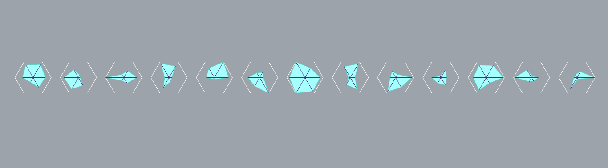

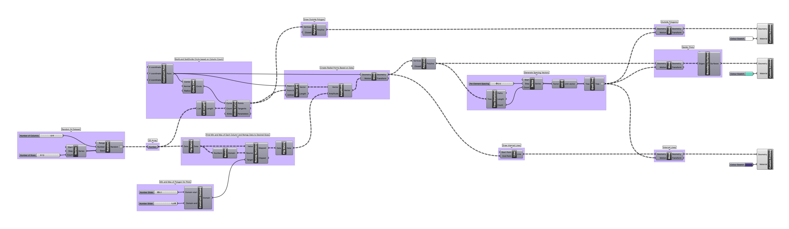

-----

### Fabric Pattern Construction

Developed pattern for soft-materials construction.

[Download Definition](bra_pattern.gh)

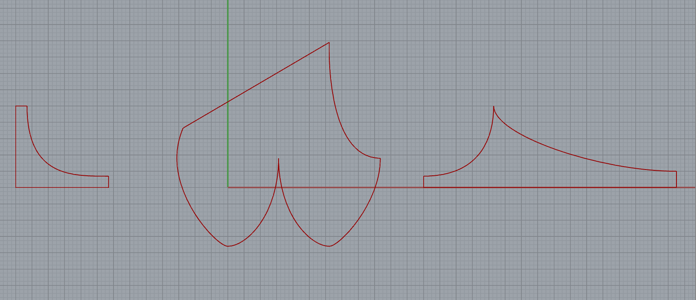

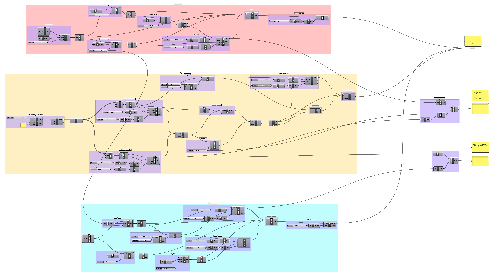

-----

### Audio Sample Surface

Audio data as [sampled amplitudes](https://github.com/zachpino/digidev-s18/blob/master/week09/README.md) realized as a revolved form.

[Download Definition](audio.gh)

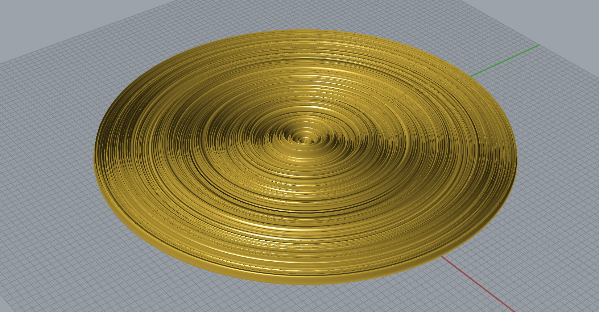

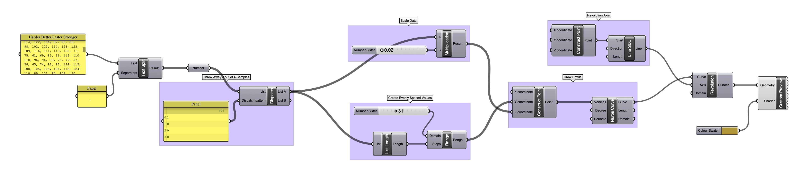

-----

### GeoJSON Map Data

Though Grasshopper can natively handle logitude-latitude couplets, the [Humpback](https://www.food4rhino.com/app/humpback) plugin is required to convert GeoJSON polygons into Grasshopper forms. Follow the installation instructions!

You would likely want to grab geojson files from places [like this](https://data.cityofchicago.org/Community-Economic-Development/Boundaries-Zoning-Districts-current-/7cve-jgbp) and simplify them with [Mapshaper](http://mapshaper.org). Befitting its name, Humpback is *slow*, and so requires simplified input data. There are likely better ways of parsing geographic data, but Humpback is a good place to start.

[Download Definition](maps.gh)

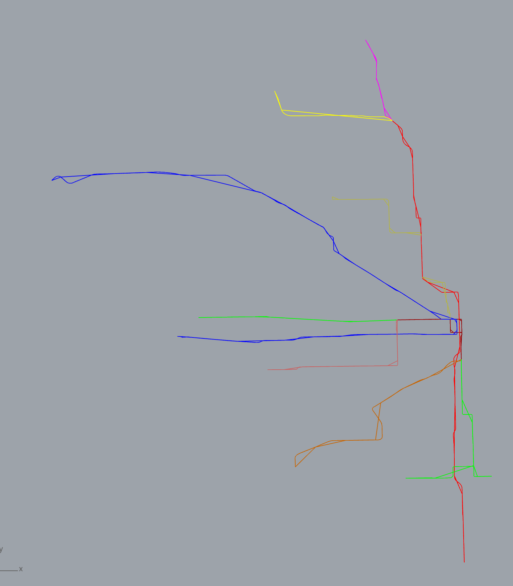

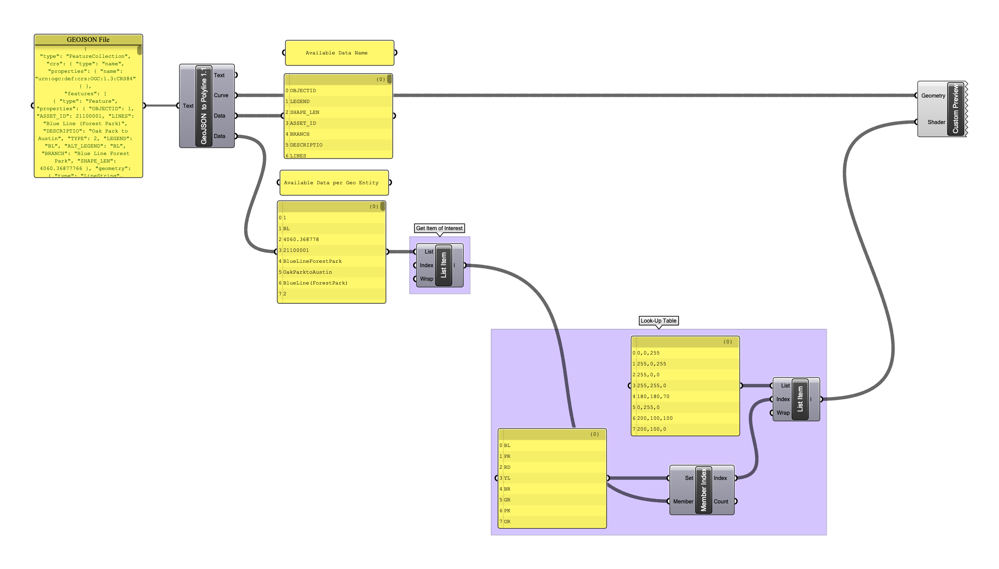

-----

### Data Lofts  

Make a connecting surface between data-driven polygons along an axis.

[Download Definition](dataloft.gh)

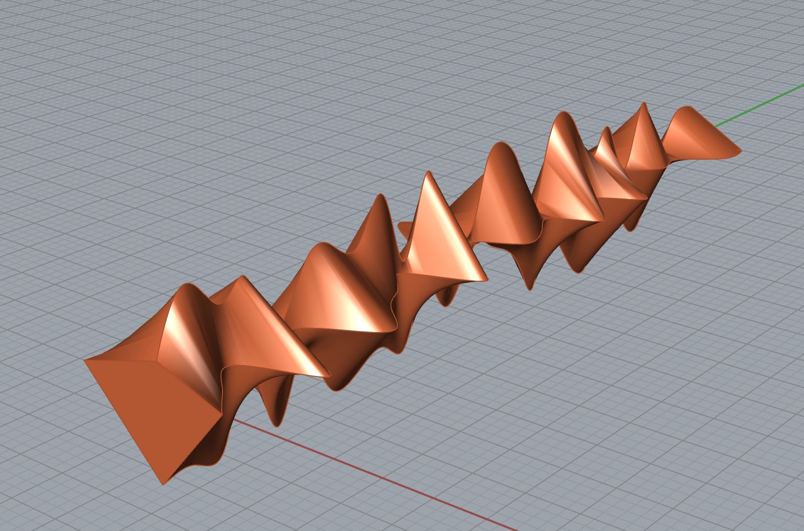

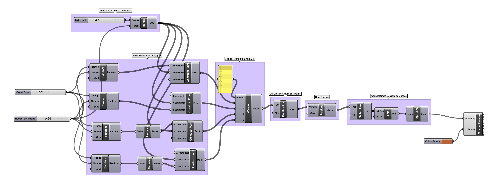

-----

### Waveform Surface

ECG waveform plotting, extrustion, and solid construction.

[Download Definition](ecg-definition.gh)

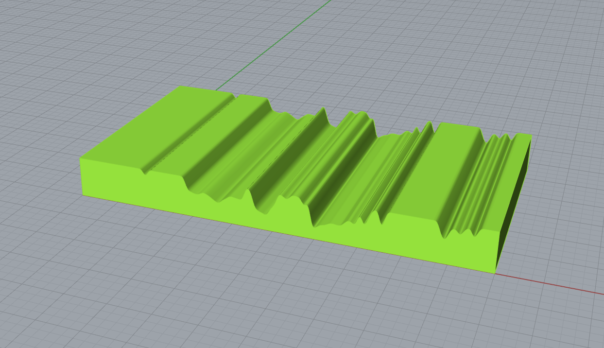

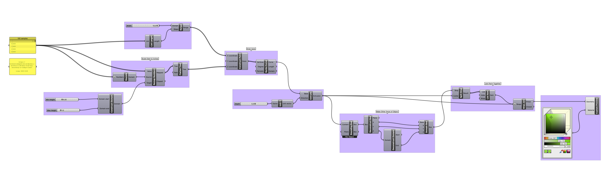

-----

### Styled Prosthetics

Calf forms, created from ellipses, tiled and patterned with various panelling algorithms from [Lunchbox](https://www.food4rhino.com/app/lunchbox) and Pull-to-Surface logics.

[Download Definition](prosthetic.gh)

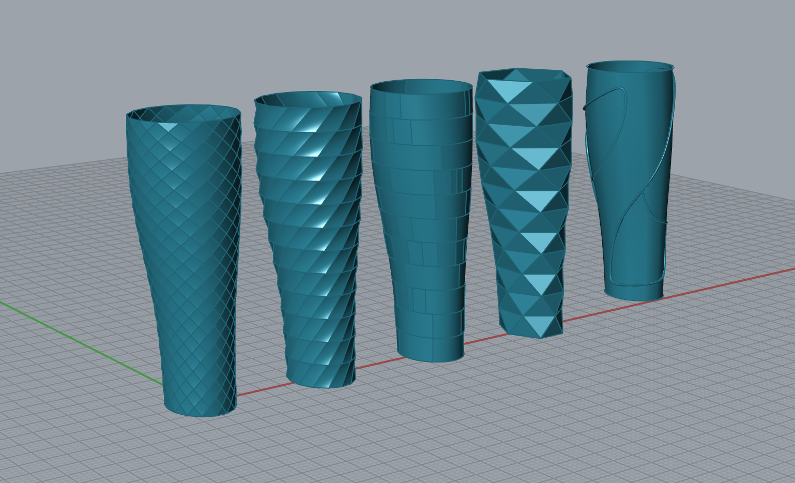

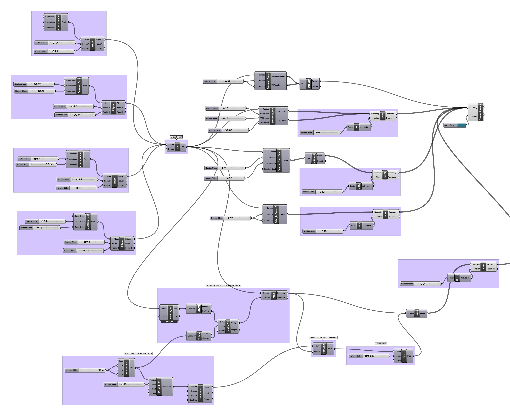

-----

### Twistars

Twisting star patterns recreating this awesome [3D printed generative sweets](https://www.dentsu.com/news/release/2020/0217-010018.html) project.

[Download Definition](twistar-definition.gh)

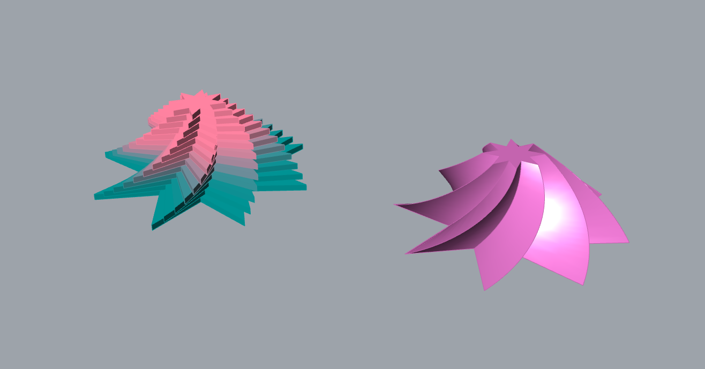

---

### Data Blossoms

Data mapped to controllable arc, joined to other splines, and projected into expressive three-dimensions.

[Download Definition](sakura-definition.gh)

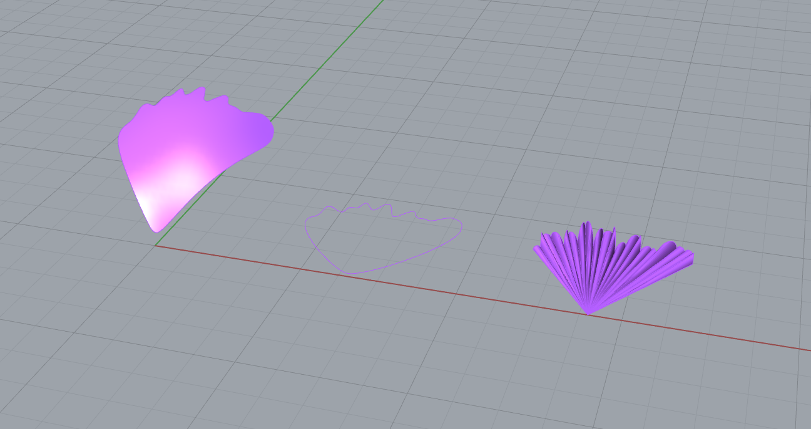

-----

### Stacked Area Plots

Show partitative data across a single shared dimension.

[Download Definition](stacked-area-definition.gh)

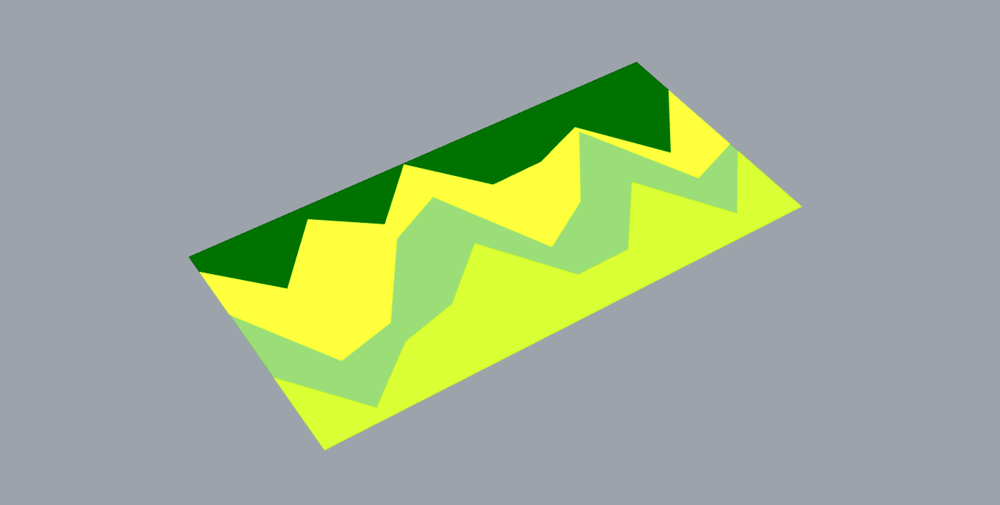

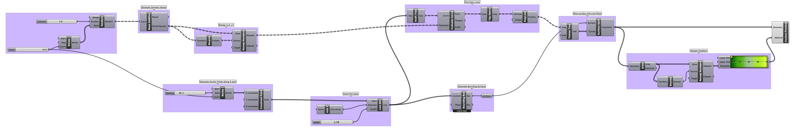

-----

### Heightfield

Take a specific channel from an image (brightness, red, green, blue) and use it to define the variable height of a topographical mesh.

[Download Definition](image-sampler-definition.gh)

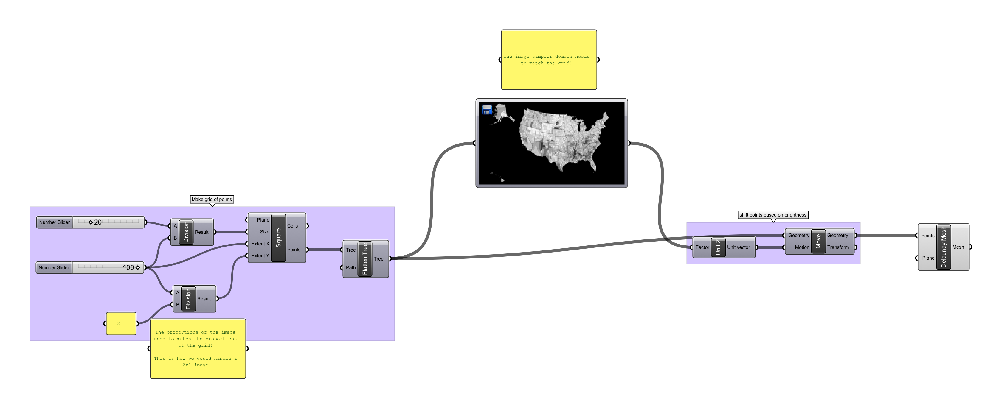

-----

### Breathing Masks

Simple breathing mask model, deformed with data.

[Download Definition](mask-definition.gh)

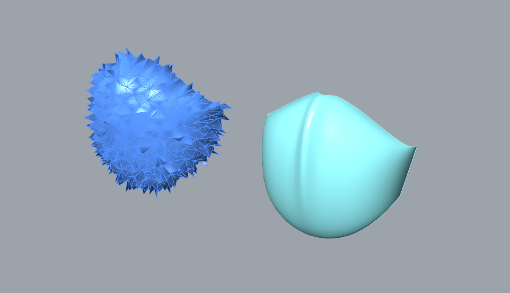

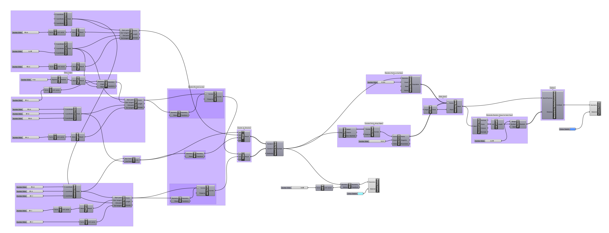

-----

### Textures/Topographies/Terrains

A couple different methods to build textured terrains based on data.

[Download Definition](terrains-definition.gh)

-----

### Homework

Do projects!