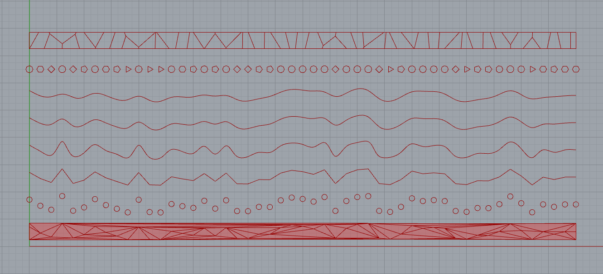

# Week 11 · More Examples and Rendering

### Agenda

- Check-In (Deliverable Timing, Attendance Note, Individual Meetings)
- Coronavirus Visualization Check-in
- John Conway Tribute
- Relaxation through Generative Tools
- Break
- Baking and Rendering
- Example Files
- Break
- Small Group Sharing and Worktime

-----

### Attendance Note

Please only work in class for around 2 hours, and please use the remaining time to attend the [online talk tonight](https://www.eventbrite.com/e/webinar-latham-fellow-adrien-segal-form-follows-data-tickets-100522832498) (4/15/2020) with [Adrien Segal](https://www.adriensegal.com/about) from 6pm to 7pm (with questions continuing afterwards). Ask questions, she's amazing! 

Any thoughts on [Knut Synstad's](http://knutsynstad.com) talk last week?

---

### Some sad news...

[John Conway](https://en.wikipedia.org/wiki/John_Horton_Conway) — [brilliant mathematican, computer programmer, and philosopher](https://en.wikipedia.org/wiki/Conway%27s_Game_of_Life) — passed away from COVID-19-related symptoms. His work was fundamental to so much of contemporay generative design practice, and his [eloquence and charisma](https://www.theguardian.com/science/2015/jul/23/john-horton-conway-the-most-charismatic-mathematician-in-the-world) as an educator welcomed so many non-computer-scientists into emergent disciplines. He remains a hero and inspiration.

- [XKCD Tribute](https://xkcd.com/2293/)
- [Numberphile Podcast](https://www.numberphile.com/podcast/john-conway-tribute) on his life and accomplishments
- [Numberphile Interviews with Numberphile](https://www.youtube.com/watch?v=E8kUJL04ELA&list=PLt5AfwLFPxWIL8XA1npoNAHseS-j1y-7V)

-----

### Some good news... 

Finland has [proceeded to advocate]([http://demoscene-the-art-of-coding.net/2020/04/15/breakthrough-finland-accepts-demoscene-on-their-national-list-of-intangible-cultural-heritage-of-humanity/]
) for the [Demoscene](https://en.wikipedia.org/wiki/Demoscene) as the first example of an *intangible human culture* to be included on the UNESCO world heritage list. This is a big deal for [script kiddies](https://en.wikipedia.org/wiki/Script_kiddie) like Zach who joined in the Demoscene and other early internet cultures, and the many others who participated in this movement and seeded generative design aesthetics and approaches.

----

### Generative Relaxation

A lot of the simpler approaches we looked at several weeks ago, focusing on randomness and pattern, have been put to use in many applications that strive to combine sound, image, and ritual into new sorts of interactive, meditatitve, digital experiences. Perhaps, in these times of crisis, uncertainty, and anxiety, these new generative experiences could provide some small comfort and distraction.

- [Endel.io](https://endel.io)
- [Silk](http://weavesilk.com)
- [Non · Sensory](http://sensorymeditation.com)
- [Whorl](https://wwwhorl.com)
- [Land Waves](https://apps.apple.com/hu/app/land-waves/id985925319)
- [We Mantra](https://apps.apple.com/bm/app/we-mantra-experience/id858433234)
- [Longplayer](https://longplayer.org)
- [Mubert](https://mubert.com/channels/)
- [Brian Eno's Stuff](http://www.generativemusic.com)

-----

### Baking and Rendering

We'll discuss how we can produce pseudo-photorealistic renderings of Grasshopper objects via Rhino's built-in [biased](https://www.cgvizstudio.com/biased-vs-unbiased-rendering-engine/) rendering engine. This [tutorial](https://www.youtube.com/watch?v=CZxzM8Cq7Ak) covers the same [*material*](https://giphy.com/gifs/terrible-pun-Qem49y6xGw57W). Some projects might need some alterations to manage data-driven coloring, often incorporating [Lunchbox's](https://www.food4rhino.com/app/lunchbox) *Object Bake* node.

Other renderers worth checking out...

- [V-Ray for Grasshopper](https://www.chaosgroup.com/blog/jan-kokol-v-ray-for-grasshopper)
- [Keyshot](https://www.keyshot.com)
- [Octane](https://home.otoy.com/render/octane-render/showcase/)
- [Pixar's Renderman](https://renderman.pixar.com)
- [Houdini](https://www.sidefx.com)
- [Maxwell Render](https://maxwellrender.com)
- [Ray-Trace Rendering in Upcoming XBOX Series X and PS5](https://www.youtube.com/watch?v=Mr8vmuNEekg)
- [Ray-Traced Minecraft](https://www.polygon.com/2019/4/21/18510039/minecraft-ray-tracing-mod-tech-demonstration-video-pc-digital-foundry)

---

### Grasshopper Examples

Find below additional head-starts, and also reference [last week's set](../week10/README.md).

---

### Data Helix

Twist data around and around a central axis.

[Download Definition](data-helix-definition.gh)

-----

### 2-Part Data Prisms

Show partitive data with a plit prism. Is this a 3D [spider plot](https://en.wikipedia.org/wiki/Radar_chart)?

[Download Definition](data-prisms-definition.gh)

-----

### Expose Possibilities in Data Visualization

Offer options for displaying data in structured 2-dimensional patterns

[Download Definition](dataesthetic-choice-definition.gh)

-----

### Network Connections 

Connect nodes with weighted edges. Also consider [Cyto- and Exo-skeleton](https://www.grasshopper3d.com/profiles/blogs/exoskeleton-cytoskeleton-components).

[Download Definition](network-links-definition.gh)

-----

### Pattern Attraction

Manipulate a pattern based on a distorting curve.

[Download Definition](pattern-attractor-definition.gh)

-----

### Polygonal Helix

Wrap data around a repeating polygonal boundary.

[Download Definition](polygonal-helix-definition.gh)

-----

### Sakura Papercuts

Generate papercut templates based on serial data. Lots of fancy list management tricks!

[Download Definition](sakura-cut-definition.gh)

-----

### Voronoi Puzzle

Create a mating blocks puzzle based on a singular datapoint.

[Download Definition](voronoi-puzzle-definition.gh)

-----

### Homework

Do projects! Meet with Zach! Maybe more to come, not sure just yet. But, y'all know what to do.
