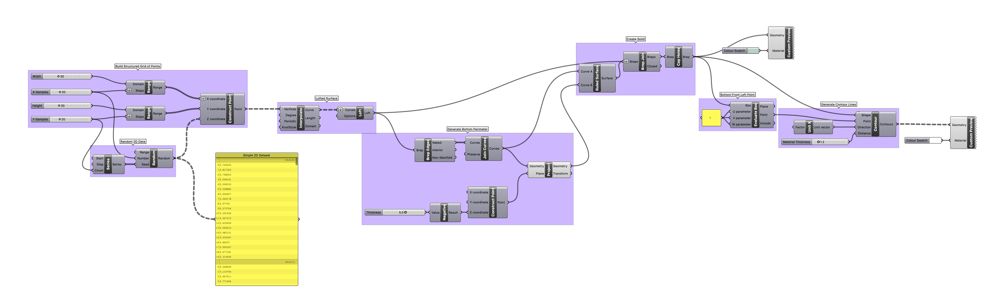
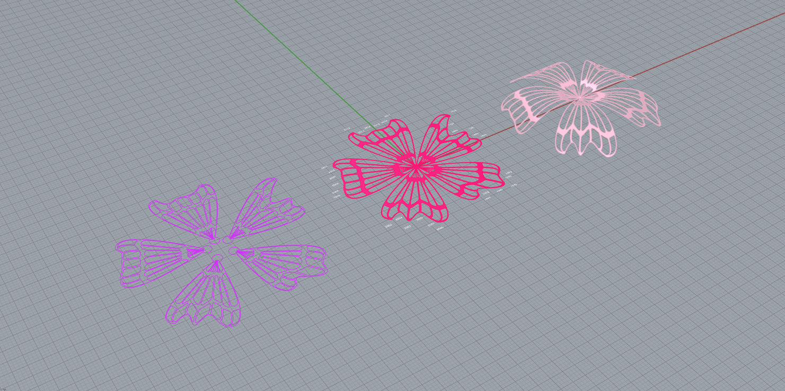

# Week 12 · Even More Examples!

### Agenda

- Check-In (Deliverable Timing, Individual Meetings)
- [Adrien Segal's](https://www.adriensegal.com) Lecture
- Coronavirus Visualization Check-in
- Break
- 3D Printing, Lasercutting, Printing
- Example Files
- Break for Worktime
- Asks for Next Week

-----

### Attendance Note

Please only work in class for around 2 hours, and please use the remaining time to continue your project, meet with Zach individually, and discuss your project with your others! 

---

### Adrien Segal

Any thoughts on [Adrien Segal's](https://www.adriensegal.com) talk last week? 

Productive overlap or friction with [Knut Synstad's](http://knutsynstad.com) talk? 

----

### 3D Printing and Laser-Cutting

We need to get some orders in by next Friday, May 1. Please prepare Grasshopper, Rhino, or Illustrator files for ordering from...

- [Shapeways for 3D Printing](https://www.shapeways.com)

- [Ponoko for Laser-Cutting](https://www.ponoko.com)

- [Spoonflower for (Fabric) Printing](https://www.shapeways.com)

Browse these site and make decisions around materiality and scale. Any other vendors we should be ordering from?

-----

### Grasshopper Examples

Find below additional head-starts, and also reference [last week's set](../week11/README.md) and the [set from the week prior](../week10/README.md).

---

### Climate Data Helix

Helical spiderplot using data from [AQICN](https://aqicn.org/data-platform/covid19).

[Download Definition](climate-data-helix-definition.gh)

[Download Referenced Data](waqi-covid19-airqualitydata-2020.csv)

-----

### Contour Lines

Slice up topographies into lamination curves for fabrication.

[Download Definition](contour-lines-definition.gh)

-----

### Enclosed Data Helices

Plot data along helix, and enclose the form with a [minimal surface](https://en.wikipedia.org/wiki/Minimal_surface). Additional steps with Weaverbird perforate the mesh irregularly.

[Download Definition](data-helix-mesh-definition.gh)

-----

### Creating Molds

Create negative forms from positive data physicalizations for [casting](https://en.wikipedia.org/wiki/Molding_(process)) materials.

[Download Definition](data-prisms-molding-definition.gh)

-----

### Simulated Explosions

Create a minesweeper board, and blow it up with data!

[Download Definition](minesweeper-definition.gh)

-----

### Patent Topography

Create geographic topography based on US intellectual property data. Be aware that this file takes around almost 20 seconds to generate meshes.

[Download Definition](patent-topography-definition.gh)

[Download Referenced Data](data.csv)

-----

### Sakura Papercuts

Generate papercut templates, lasercut profiles, and 3d-twisted models for rendering — all based on chronological data. 

[Download Definition](sakura-bend-cut-definition.gh)

-----

### Soundwave Harp

Distort strings on a frame with audio samples.

[Download Definition](soundwave-harp-definition.gh)

-----

### Story Attractor

Take letters from a text and scramble their location on a page, as well as their sequence. Consider doing the same thing with [sampled amplitudes](https://github.com/zachpino/digidev-s18/blob/master/week09/README.md) from an audio file?

[Download Definition](story-attractor-definition.gh)

-----

### Textured Block Puzzle

Create individual nesting blocks from a series of different data points, and texture them individually.

[Download Definition](textured-block-puzzle-definition.gh)

----

### AG and GH -- I owe you an example here soon!

-----

### Homework

Do projects! Meet with Zach! Play with examples! Enjoy the fresh air but stay far away from people! 

Also, consider visiting the class homework delivery folder, and ensure you have uploaded homework files for each week. 