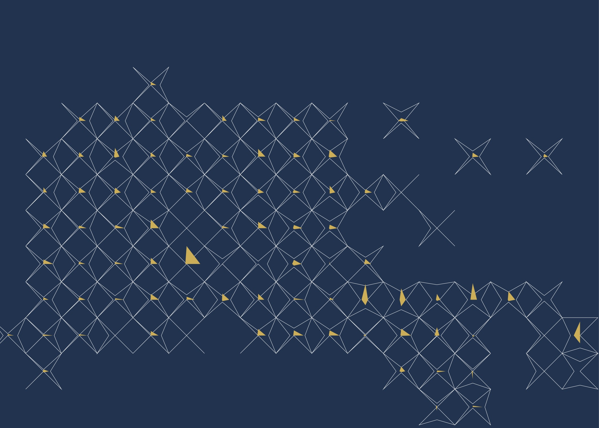

# Week 14 · Wrapping-Up Conversations and Critique

### Agenda

- Check-In (Orders Incoming -> Delivery Strategy)
- All Asset Delivery
- Course Evaluations
- Ongoing Resources
- Project Review

-----

### Check-In

It's the end. We looked at a bunch of weird stuff. Time to decompress, chat, share our work, and get some perspective!

-----

###  Deliver Everything for Grading by 5/12/20

For [pass/fail] grading, all final deliverable assets need to be submitted by **Tuesday, May 12, at noon**. Please upload all assets [here](https://drive.google.com/drive/folders/1w9fDwCYbV7QRsFCEHLPs5zE2aNf9kdxT). Work submitted in the other folders is already considered, so don't feel like you need to upload assets again. Make sure you've covered all the [requested deliverables](https://github.com/zachpino/generative-design-workshop-s20/blob/master/briefs.md), and double-check to make sure that you have submitted homework through the semester as well.

-----

### Course Evaluations - Please?!

You get email reminders every day about this. [Please please pretty please fill out an evaluation for Generative Design Workshop?](ttps://www.surveymonkey.com/r/ID-Spring2020) Historically, Zach's classes at ID receive relatively few evaluations - maybe because students are always working up until the last minute? Please take 15 minutes, if you can stare at your screen a bit more, this week!

-----

### Following the Tumultuous Generative Design World

New tools, approaches, and applications for Generative Design emerge every day, and many new papers and articles are fervently being written on many of the issues we have touched upon in this introductory course. Here is a random sampling of Generative Design and Data Visualization blogs that Zach checks regularly along with some learning resources, perhaps like and subscribe to a few of them?

- [Data Physicalization](http://dataphys.org)
- [Creative Applications](https://www.creativeapplications.net)
- [DVS Nightingale](https://www.lynda.com/Dynamo-Studio-tutorials/Generative-Design-Foundations/5030972-2.html)
- [Inconvergent](https://inconvergent.net)
- [Pudding](https://pudding.cool)
- [Data is Beautiful](https://www.reddit.com/r/dataisbeautiful/)
- [Flowing Data](http://www.storytellingwithdata.com/blog)
- [Information is Beautiful](https://informationisbeautiful.net)
- [XKCD](https://xkcd.com)
- [Design Coding](http://www.designcoding.net)
- [Storytelling with Data](http://www.storytellingwithdata.com/blog)
- [Autodesk's Generative Design Blog](https://blogs.autodesk.com/generative-design/)

Here are some additional resources, which aim to empower new generative designers but can sometimes intimidate. Hopefully, they are more approachable now that you all have engaged generative approaches over the last 14 weeks.

- [Parametric House](https://parametrichouse.com)
- [Lynda Generative Design Course](https://www.lynda.com/Dynamo-Studio-tutorials/Generative-Design-Foundations/5030972-2.html)
- [Lynda Grasshopper Course](https://www.lynda.com/Grasshopper-tutorials/Up-Running-Grasshopper/174491-2.html)

Let Zach and other ID faculty know what sorts of classes might make sense in this domain. It is always an experiment, and I would love to know what we could do to better support your ongoing interest in this space.

-----

### This GitHub Repository

This resource will still be available so long as Zach has a Github account! Please return to it in the future. But, let's talk about how you can archive it.

-----

### Orienting Spectra to Continue Thinking About...

In no particular order... and let's add more! 

- Authored <-> Designed <-> Generated 
- Tool <-> Approach <-> Outcome
- General Purpose <-> Hyper-Specificity
- Small Data <-> Big Data <-> Mystical Data
- Dataesthetics <-> Form+Function
- Naive Practitioner <-> Expert
- Proposed Options <-> Designed Solution/Intervention
- Confidence <-> Certainty

-----

### Final Projects! 

(This list will be updated with photos of objects and more projects as they wrap-up...) 

Let's browse through some of the work of our class members. Let Zach know if you would prefer to have these works removed after today, or linked to your name/website.

-----

#### Sonotoype I

-----

#### Patent Topographies

#### Patent Animation

-----

#### Friendship Bracelets

 
 

-----

#### Footprint

 

-----

#### Time Well Spent?

 
 

-----

#### In Our Feelings

-----

#### Family Sakura

#### Kyoto Sakura

-----

#### Wasted Food Clips

-----

#### Minesweeper Brought to You By Women

-----

#### COVID-19 Memories

-----

#### Generative Masks

-----

### Mend

----

### Instill

----

### Unwind

-----

### Generative Personalized Nutrition Gummies

-----

Thanks for scrolling to the bottom! You all have been an extraordinary class to work with — slashing through technical, procedural, and conceptual challenges with ease. Thank you for all of your time, effort, goodwill, ambition, versatility, courage in the face of weird stuff, and — most of all — your patience and energy in such difficult times. It has been an honor to collaborate with you all through the last 14 weeks, and I hope to continue working with you all in some format going forward. 

Thank you. :robot: