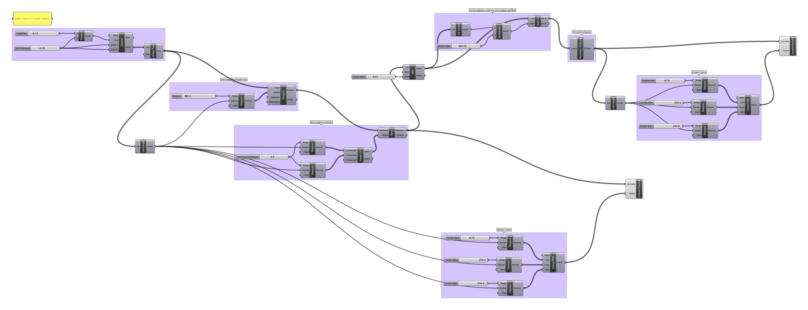

##### Image Sampler

Extract brightness data from an image and create 3D [heightmaps](https://en.wikipedia.org/wiki/Heightmap).

[Download](image-sampler-definition.gh)

##### After Molnár and Tarbell

Let's experiment with randomness to produce geometric patterns inspired by the works of [Molnár](http://www.veramolnar.com) and [Tarbell](http://www.complexification.net/gallery/), two extraordinary generative artists who work with controlled randomness and grids towards new aesthetic definitions. Take a regular grid, place polygons at every node, and distort every aspect of the resulting composition including polygon vertex count, rotation, placement, overall distortion, stroke color, fill color, stroke thickness...

[Download](random-pattern-definition.gh)

